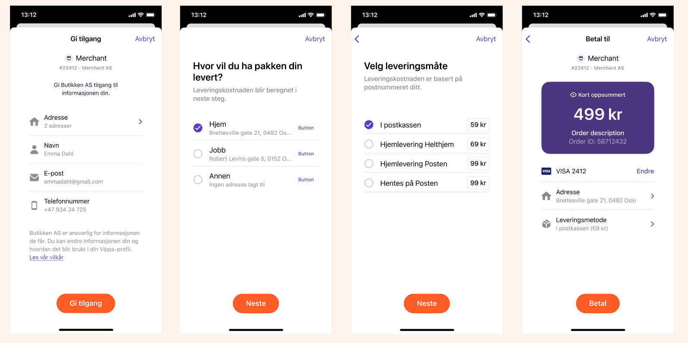

# How eCom works online

This is how payment with the eCom API works.

## The Vipps eCommerce payment process

## 1. Pay with Vipps

The user chooses “Pay with Vipps”, either in the checkout, or on the product page (express checkout) of a merchant’s website or app.

## 2. The landing page (If customer started on desktop)

If the payment was started on a desktop device the user will be sent to the
[landing page](https://developer.vippsmobilepay.com/docs/vipps-developers/common-topics/landing-page).
The user confirms their number, and is prompted to log in to Vipps.

If the payment was started from a mobile device, the app will automatically switch over to Vipps.

## 3. Confirm payment in Vipps

The user receives a push notification on their phone. They log in to Vipps and confirm the payment. The payment is reserved, and the user gets a receipt of the successful payment

For Express checkout (*Vipps Hurtigkasse*), the user must give access and then choose a shipping method.

## 4. Order Confirmation

The user is redirected back to the merchant’s store, and the order is confirmed.

## 5. Completing the order and shipping

The merchant completes the order, and ships the order to the customer.

## 6. Money in the bank

The payment is transferred to the merchant’s account. This may take 2-3 days depending on your bank.

Great! Now you know how the payment process works.

Read all the technical details in the [Vipps eCommerce API Guide](../vipps-ecom-api.md)
