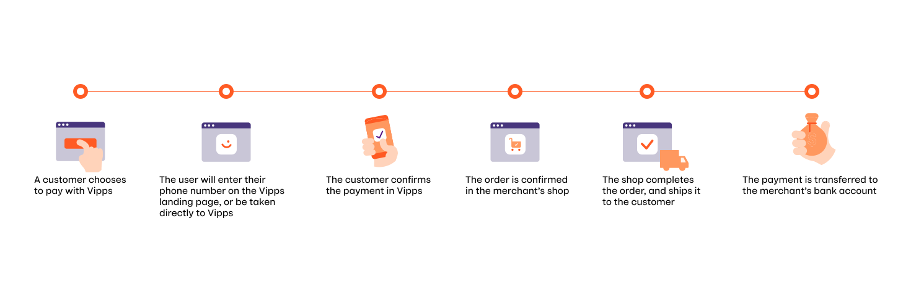
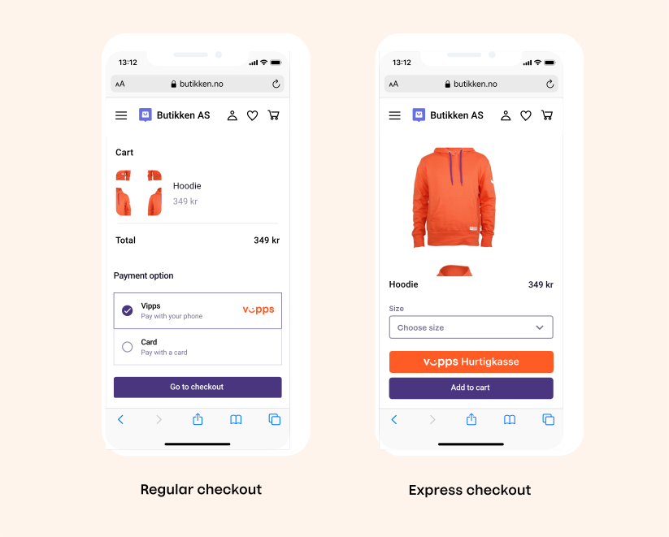
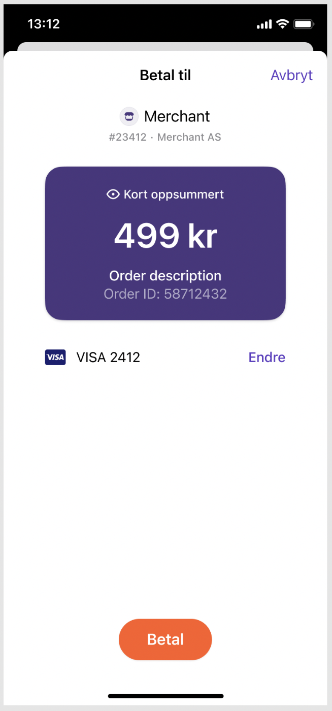

<!-- START_METADATA
---
title: How it works
sidebar_position: 6
---
END_METADATA -->

# Vipps eCommerce API: How It Works

This is how payment with Vipps eCommerce works.

## The ecommerce payment process

## 1. Pay with Vipps

The user chooses “Pay with Vipps”, either in the checkout, or on the product page (express checkout) of a merchant’s website or app.

## 2. The Vipps landing page (If customer started on desktop)

If the payment was started on a desktop device the user will be sent to the Vipps landing page.
The user confirms their number, and is prompted to log in to Vipps.

If the payment was started from a mobile device, the app wil automatically switch over to Vipps.

## 3. Confirm payment in Vipps

The user receives a push notification on their phone. They log in to Vipps, and confirm the payment. The payment is reserved and the user gets a receipt of the successful payment

For Vipps Hurtigkasse (express checkout) the user also have to choose a
shipping method.

For Vipps Hurtigkasse (express checkout):

The new express checkout flow (`"useExplicitCheckoutFlow": true`):

The old express checkout flow (`"useExplicitCheckoutFlow": false`):

## 4. Order Confirmation

The user is redirected back to the merchant’s store, and the order is confirmed.

## 5. Completing the order and shipping

The merchant completes the order, and ships the order to the customer.

## 6. Money in the bank

The payment is transferred to the merchant’s account. This may take 2-3 days depending on your bank.

## Great! Now you know how the payment process works.

Take a look at the technical documentation in the [Vipps eCommerce API Guide](vipps-ecom-api.md).

## Questions?

For information in Norwegian, see: [Vipps på nett](https://vipps.no/produkter-og-tjenester/bedrift/ta-betalt-paa-nett/ta-betalt-paa-nett/).

We're always happy to help with code or other questions you might have!
Please create an [issue](https://github.com/vippsas/vipps-ecom-api/issues),
a [pull request](https://github.com/vippsas/vipps-ecom-api/pulls),
or [contact us](https://github.com/vippsas/vipps-developers/blob/master/contact.md).

Sign up for our [Technical newsletter for developers](https://github.com/vippsas/vipps-developers/tree/master/newsletters).
