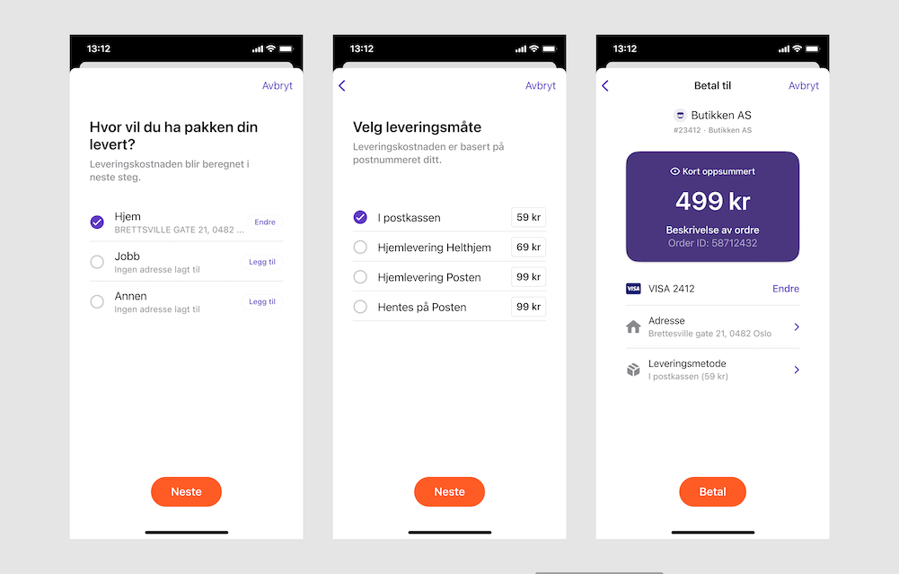
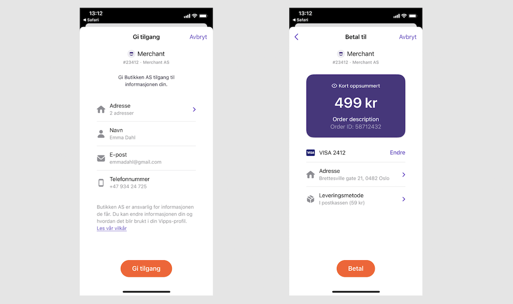

<!-- START_METADATA
---
title: API Guide
sidebar_position: 15
---
END_METADATA -->

# Vipps eCommerce API

<!-- START_COMMENT -->

ℹ️ Please use the new documentation:
[Vipps Technical Documentation](https://vippsas.github.io/vipps-developer-docs/).

<!-- END_COMMENT -->

The Vipps eCom API is used by
[Vipps på nett (*Vipps Online*)](https://vipps.no/produkter-og-tjenester/bedrift/ta-betalt-paa-nett/ta-betalt-paa-nett/),
[Vipps Checkout](https://vipps.no/produkter-og-tjenester/bedrift/ta-betalt-paa-nett/vipps-checkout/),
[Vipps i kassa (*Vipps in Store*)](https://vipps.no/produkter-og-tjenester/bedrift/ta-betalt-i-butikk/vipps-i-kassa/),
native apps and other solutions.

API version: 2.0.0.

Document version 2.8.0.

<!-- START_TOC -->

## Table of contents

- [Payment flows](#payment-flows)
- [Quick start](#quick-start)
- [API endpoints](#api-endpoints)
- [Authentication](#authentication)
- [Vipps HTTP headers](#vipps-http-headers)
- [Initiate](#initiate)
  - [Regular payments and express payments](#regular-payments-and-express-payments)
  - [Regular eCommerce payments](#regular-ecommerce-payments)
  - [Express checkout payments](#express-checkout-payments)
     - [Old and new express checkout flow](#old-and-new-express-checkout-flow)
     - [How to specify the old or new express checkout flow](#how-to-specify-the-old-or-new-express-checkout-flow)
     - [Shipping and static shipping details](#shipping-and-static-shipping-details)
     - [Consent and GDPR](#consent-and-gdpr)
  - [Phone and mobile browser flow](#phone-and-mobile-browser-flow)
     - [Vipps installed](#vipps-installed)
     - [Vipps not installed](#vipps-not-installed)
  - [Desktop flow](#desktop-flow)
  - [Payments initiated in an app](#payments-initiated-in-an-app)
  - [Initiate payment flow: API calls](#initiate-payment-flow-api-calls)
  - [The Vipps deeplink URL](#the-vipps-deeplink-url)
     - [isApp](#isapp)
  - [Payment identification](#payment-identification)
  - [Payment retries](#payment-retries)
  - [OrderId recommendations](#orderid-recommendations)
  - [transactionText recommendations](#transactiontext-recommendations)
  - [URL Validation](#url-validation)
- [Callbacks](#callbacks)
  - [Callback URLs](#callback-urls)
  - [Callback examples](#callback-examples)
  - [How to test your own callbacks](#how-to-test-your-own-callbacks)
  - [Authorization for callbacks](#authorization-for-callbacks)
  - [Vipps callback servers](#vipps-callback-servers)
  - [Callback statuses](#callback-statuses)
- [Timeouts](#timeouts)
  - [Using a phone](#using-a-phone)
  - [Using a PC](#using-a-pc)
- [Express checkout API endpoints required on the merchant side](#express-checkout-api-endpoints-required-on-the-merchant-side)
  - [Get shipping details](#get-shipping-details)
  - [Payment update](#payment-update)
  - [Remove User Consent](#remove-user-consent)
- [The Vipps landing page](#the-vipps-landing-page)
  - [Generating a QR code to the Vipps landing page](#generating-a-qr-code-to-the-vipps-landing-page)
  - [Skip landing page](#skip-landing-page)
- [Reserve](#reserve)
- [Capture](#capture)
  - [Reserve capture](#reserve-capture)
  - [Direct capture](#direct-capture)
  - [Partial capture](#partial-capture)
- [Cancel](#cancel)
  - [Cancelling a pending order](#cancelling-a-pending-order)
  - [Cancelling a partially captured order](#cancelling-a-partially-captured-order)
- [Refund](#refund)
- [Get payment details](#get-payment-details)
  - [Payment states](#payment-states)
  - [Requests and responses](#requests-and-responses)
  - [Example response](#example-response)
  - [Polling guidelines](#polling-guidelines)
- [Get payment status](#get-payment-status)
- [Userinfo](#userinfo)
  - [Scope](#scope)
  - [Userinfo call-by-call guide](#userinfo-call-by-call-guide)
  - [Get userinfo](#get-userinfo)
  - [Userinfo call](#userinfo-call)
     - [Request](#request)
        - [Headers](#headers)
  - [Consent](#consent)
- [HTTP response codes](#http-response-codes)
- [Rate limiting](#rate-limiting)
- [Partner keys](#partner-keys)
- [Idempotency](#idempotency)
- [Exception handling](#exception-handling)
  - [Connection timeout](#connection-timeout)
  - [Callback aborted or interrupted](#callback-aborted-or-interrupted)
  - [PSP connection issues](#psp-connection-issues)
  - [Clean-up strategies](#clean-up-strategies)
  - [Recommendations for handling very high traffic](#recommendations-for-handling-very-high-traffic)
- [App integration](#app-integration)
- [App-switching](#app-switching)
  - [App-switch on iOS](#app-switch-on-ios)
     - [Switch from merchant app to Vipps](#switch-from-merchant-app-to-vipps)
     - [Redirect back to the merchant app from Vipps app](#redirect-back-to-the-merchant-app-from-vipps-app)
  - [App-switch on Android](#app-switch-on-android)
     - [Switching from merchant app to Vipps](#switching-from-merchant-app-to-vipps)
     - [Switching back to the merchant app from Vipps app](#switching-back-to-the-merchant-app-from-vipps-app)
     - [Return back to merchant app by actively deeplinking into it from Vipps](#return-back-to-merchant-app-by-actively-deeplinking-into-it-from-vipps)
     - [Redirect back to merchant app by simply closing Vipps](#redirect-back-to-merchant-app-by-simply-closing-vipps)
- [Errors](#errors)
  - [Error object in the response](#error-object-in-the-response)
  - [Error groups](#error-groups)
  - [Error codes](#error-codes)
- [Testing](#testing)
- [Recommendations regarding handling redirects](#recommendations-regarding-handling-redirects)
- [Questions?](#questions)

<!-- END_TOC -->

## Payment flows

There are many ways to use the Vipps eCom API. For example:

* *Vipps Online (aka Vipps på nett)* - The customer selects Vipps as the method
  of payment and enters their mobile number into the app or website. The merchant
  initiates the payment command. The customer confirms the purchase through their
  Vipps app. If the purchase is approved, the merchant registers the sale in
  their system. See
  [Vipps eCommerce API: How It Works](vipps-ecom-api-howitworks.md) for more information.
* *Vipps Express Checkout (aka Vipps Hurtigkasse)* - The same as *Vipps Online*
  except that the shipping address and package delivery options that are selected
  in the Vipps app.
* *Vipps Checkout* - The same as *Vipps Online* except that, instead of
  confirming the purchase in the Vipps app, the customer consents to sharing
  their personal information (e.g., address, phone, and payment information).
  They then complete the purchase from the website where their information is
  automatically pre-filled.
* *Vipps In Store (aka Vipps i kassa)* - The same as *Vipps Online* except that
  the phone number is provided to the service provider who then initiates the
  payment through their Point of Sale (POS) system. See
  [Vipps in store](vipps-in-store-howitworks.md) for more information.

This diagram shows a simplified payment flow:


See [Get payment details](#get-payment-details) for more information about
the detailed flow and [Payment states](#payment-states) for the corresponding
states.

The flow of settlements and how to retrieve them are described in
[Settlements](https://github.com/vippsas/vipps-developers/tree/master/common-topics/settlements).

## Quick start

The normal "happy day" flow for a payment is documented in the
[Quick start guide](vipps-ecom-api-quick-start.md).

This API guide is extensive: We have done our best to document everything about
this API, and you *should* have all information needed to integrate with Vipps.

## API endpoints

The Vipps eCommerce API (eCom API) offers functionality for online payments.
Payments are supported in both web browsers and in native apps (via deep-linking).

| Operation                                                                                                            | Description                                                                                                | Endpoint |
|:---------------------------------------------------------------------------------------------------------------------|:-----------------------------------------------------------------------------------------------------------|:-|
| [Initiate payment](#initiate)                                                                                        | Payment initiation, the first request in the payment flow. This *reserves* an amount.                      | [`POST:/ecomm/v2/payments`](https://vippsas.github.io/vipps-developer-docs/api/ecom#tag/Vipps-eCom-API/operation/initiatePaymentV3UsingPOST) |
| [Capture payment](#capture)                                                                                          | When an amount has been reserved, and the goods are (about to be) shipped, the payment must be *captured*. | [`POST:/ecomm/v2/payments/{orderId}/capture`](https://vippsas.github.io/vipps-developer-docs/api/ecom#tag/Vipps-eCom-API/operation/capturePaymentUsingPOST) |
| [Cancel payment](#cancel)                                                                                            | The merchant may cancel a reserved amount, but not on a captured amount.                                   | [`PUT:/ecomm/v2/payments/{orderId}/cancel`](https://vippsas.github.io/vipps-developer-docs/api/ecom#tag/Vipps-eCom-API/operation/cancelPaymentRequestUsingPUT) |
| [Refund payment](#refund)                                                                                            | The merchant may refund a captured amount.                                                                 | [`POST:/ecomm/v2/payments/{orderId}/refund`](https://vippsas.github.io/vipps-developer-docs/api/ecom#tag/Vipps-eCom-API/operation/refundPaymentUsingPOST) |
| [Get payment details](#get-payment-details)                                                                          | The full history of the payment.                                                                           | [`GET:/ecomm/v2/payments/{orderId}/details`](https://vippsas.github.io/vipps-developer-docs/api/ecom#tag/Vipps-eCom-API/operation/getPaymentDetailsUsingGET) |
| [Access Token](https://github.com/vippsas/vipps-developers/blob/master/vipps-getting-started.md#get-an-access-token) | Fetch the access token                                                                                     | [`POST:/accesstoken/get`](https://vippsas.github.io/vipps-developer-docs/api/ecom#tag/Authorization-Service/operation/fetchAuthorizationTokenUsingPost) |
| Get order status                                                                                                     | Deprecated, use [Get payment details](#get-payment-details).                                               | Deprecated, use [`GET:/ecomm/v2/payments/{orderId}/details`](https://vippsas.github.io/vipps-developer-docs/api/ecom#tag/Vipps-eCom-API/operation/getPaymentDetailsUsingGET) |

See the
[eCom API checklist](vipps-ecom-api-checklist.md).

## Vipps HTTP headers

We recommend using the standard Vipps HTTP headers for all requests.

See [Vipps HTTP headers](https://github.com/vippsas/vipps-developers/blob/master/vipps-getting-started.md#vipps-http-headers)
in the Getting started guide, for details.

## Authentication

All Vipps API calls are authenticated with an access token and an API subscription key.
See
[Get an access token](https://github.com/vippsas/vipps-developers/blob/master/vipps-getting-started.md#get-an-access-token)
in the Getting started guide, for details.

## Initiate

Payment amounts must be in NOK, be non-zero *and* larger than 1 NOK (1 NOK = 100 øre).

Amounts are specified in minor units.
For Norwegian kroner (NOK) that means 1 kr = 100 øre.
Example: 499 kr = 49900 øre.

When you initiate a payment, it will normally only be *reserved* until you capture it.

This has some benefits:

* If a payment has been _reserved_, the merchant can
  make a
  [`PUT:/ecomm/v2/payments/acme-shop-123-order123abc/cancel`](https://vippsas.github.io/vipps-developer-docs/api/ecom#tag/Vipps-eCom-API/operation/cancelPaymentRequestUsingPUT)
  call to immediately release the reservation.
* It is possible to reserve a higher amount and only
  capture a part of it (useful for electric car charging stations, etc).
  It is also possible to capture the full amount
  with multiple captures ("partial capture").

See:

* [Reserve](#reserve)
* [Capture](#capture)
* [When should I charge the customer](https://vippsas.github.io/vipps-developer-docs/docs/APIs/ecom-api/vipps-ecom-api-faq#when-should-i-charge-the-customer).
* [What is the difference between "Reserve Capture" and "Direct Capture"?](https://vippsas.github.io/vipps-developer-docs/docs/APIs/ecom-api/vipps-ecom-api-faq#what-is-the-difference-between-reserve-capture-and-direct-capture)
* [When should I use "Direct Capture"?](https://vippsas.github.io/vipps-developer-docs/docs/APIs/ecom-api/vipps-ecom-api-faq#when-should-i-use-direct-capture)

### Regular payments and express payments

Vipps eCommerce API offers two types of payments:

1. Regular eCommerce payments
2. Express checkout payments

Examples from a demo website:


### Regular eCommerce payments

This is the typical flow, where the user adds items to a shopping cart,
enters the shipping address and pays.

See:

* [How it works](https://vippsas.github.io/vipps-developer-docs/docs/APIs/ecom-api/vipps-ecom-api-howitworks)
* [How it works in the store](https://vippsas.github.io/vipps-developer-docs/docs/APIs/ecom-api/vipps-in-store-howitworks)

### Express checkout payments

The Express checkout (Vipps Hurtigkasse) is a solution for letting the user
automatically share the address information with merchant and choose a shipping option.

Express checkout is designed for shipping products, with a delivery address and a
shipping method.

**Please note:** If you only need the user's information, you should use
[Userinfo](#userinfo).
You should avoid asking the customer in a pub for the shipping method for the drinks, etc.

Vipps Hurtigkasse works this way, as seen from the user's side:

1. The user clicks the "Vipps Hurtigkasse" button.
2. The user consents to sharing address information in Vipps.
3. The user confirms the amount, delivery address and delivery method in Vipps.

To perform an express checkout, the merchant needs to specify
`"paymentType": "eComm Express Payment"` in the
[`POST:/ecomm/v2/payments`](https://vippsas.github.io/vipps-developer-docs/api/ecom#tag/Vipps-eCom-API/operation/initiatePaymentV3UsingPOST)
call, and support the
[`POST:[shippingDetailsPrefix]​/v2​/payments​/{orderId}​/shippingDetails`](https://vippsas.github.io/vipps-developer-docs/api/ecom#tag/Merchant-Endpoints/operation/fetchShippingCostUsingPOST)
and
[`DELETE:/v2/consents/{userId}`](https://vippsas.github.io/vipps-developer-docs/api/ecom#tag/Merchant-Endpoints/operation/removeUserConsentUsingDELETE)
endpoints.

#### Old and new express checkout flow

This does require some background info - please bear with us.

In the old flow for the express checkout it was easy for a user to overlook
that the correct address and shipping method was used, as both were simply
displayed on the payment confirmation page. The user did not have to actively
choose an address and shipping method. This resulted in some users
inadvertently confirming the wrong address and possibly also selecting the
wrong shipping method. To fix this, we made it mandatory to select and address
and shipping method. This was released as a minor update of Vipps.

That worked well for all merchants that used Vipps Hurtigkasse *as intended*,
but not for those using it as a quick hack to speed up payments, "just get some
info about the user", Covid-19 tracking, or something else.

The new and (for some) improved flow did not work well for all. One example:
Restaurant guests could not understand why a restaurant needed their address
and shipping method for the two beers they ordered from their table.
They had not noticed the need to select those before, but definitely did now.

So: We changed it back to the way it was before, and now require merchants to
explicitly specify the new express checkout flow:

Specify `"useExplicitCheckoutFlow": true` in
[`POST:/ecomm/v2/payments`](https://vippsas.github.io/vipps-developer-docs/api/ecom#tag/Vipps-eCom-API/operation/initiatePaymentV3UsingPOST)
to get the new, explicit flow.

#### How to specify the old or new express checkout flow

The old (and for some: "normal") express checkout flow is the default.
You do not have to make any changes other than to specify
`"paymentType": "eComm Express Payment"`.

To get the new _and highly recommended_ express checkout flow: Specify this in
addition, in the `transaction` object: `"useExplicitCheckoutFlow": true`.
See
[`POST:/ecomm/v2/payments`](https://vippsas.github.io/vipps-developer-docs/api/ecom#tag/Vipps-eCom-API/operation/initiatePaymentV3UsingPOST)
for more details.

The new express checkout flow (`"useExplicitCheckoutFlow": true`):


The old express checkout flow (`"useExplicitCheckoutFlow": false`):


#### Shipping and static shipping details

The shipping methods presented to the user in Vipps are fetched from the merchant's
[`POST:[shippingDetailsPrefix]​/v2​/payments​/{orderId}​/shippingDetails`](https://vippsas.github.io/vipps-developer-docs/api/ecom#tag/Merchant-Endpoints/operation/fetchShippingCostUsingPOST)
endpoint.

If the shipping methods and cost can be known in advance, the `staticShippingDetails` field in
[`POST:​/ecomm​/v2​/payments`](https://vippsas.github.io/vipps-developer-docs/api/ecom#tag/Vipps-eCom-API/operation/initiatePaymentV3UsingPOST)
may be used to provide the shipping details up front, and thereby avoid an
extra round-trip between the Vipps backend and the merchant's server.

When using `staticShippingDetails` the shipping costs for the available
shipping methods are then sent directly, eliminating the need for the user to
first select shipping method and then for the merchant to calculate the cost for it.

We recommend using `staticShippingDetails` if possible, as it gives a faster
payment process and a better user experience. It also eliminates timeout problems
caused by delays in the merchant's or shipping partner's calculations of cost.

#### Consent and GDPR

Vipps complies with GDPR, and requires the user's consent before any information
is shared with the merchant. The merchant must provide a URL (`consentRemovalPrefix`)
that Vipps can call to delete the data. Vipps allows the user to later
remove this consent (via the Profile -> Security -> "Access to your information"
-> "Companies that remember you" screens).

### Phone and mobile browser flow

A payment is initiated with a call to
[`POST:/ecomm/v2/payments`](https://vippsas.github.io/vipps-developer-docs/api/ecom#tag/Vipps-eCom-API/operation/initiatePaymentV3UsingPOST).


Triggered by the payment initiation, the Vipps landing page will automatically
detect if is being invoked on a phone, and whether Vipps is installed on the phone.
If Vipps is installed, Vipps will automatically be opened.

#### Vipps installed

1. Vipps is invoked (with app-switch).
2. The user accepts or rejects the payment request in Vipps.
3. The Vipps backend makes a call to the merchant's `callbackPrefix` with
   information about the payment.
4. Once payment process is completed, Vipps redirects to the
   `fallBack` URL that merchant provided earlier (see above).

#### Vipps not installed

1. The landing page (in the browser) prompts the user for the phone number.
2. The Vipps backend sends a push notification to the user's phone,
   and also displays a notification on the landing page for the user to
   continue the payment in Vipps on the phone.
3. The user accepts or rejects the payment in Vipps.
4. The Vipps backend makes a call to the merchant's `callbackPrefix` with
   information about the payment.
5. Once the payment process is completed, Vipps redirects to the
   `fallBack` URL that the merchant provided earlier.

**Please note:**

1. Vipps cannot guarantee that the user will get to the
   `fallBack` URL, since the user may switch away from Vipps or "kill" the app,
   or there may be network or battery problems, etc. before the URL is opened.
   If the merchant relies 100 % on users visiting the `fallback` URL, there will
   be problems: The user has completed the payment, but the merchant ignores it.
2. If the user has started the payment in an embedded browser, such as in
   Facebook or Instagram, it is not possible for Vipps to open the
   `fallBack` URL in the embedded browser. The phone OS will always open URLs
   in the default browser. See:
   [Recommendations regarding handling redirects](#recommendations-regarding-handling-redirects).
3. Because of the above, a successful payment *must not* rely on session cookies
   in the browser.
4. Vipps cannot guarantee a particular sequence of callback and fallback,
   as this depends on user actions, network connectivity/speed, etc.
   Because of this, it is not possible to base an integration on a specific
   sequence of events.
5. URLs must be valid. See:
   [URL validation](#url-validation)

### Desktop flow


1. The landing page will be opened in the desktop browser.
2. The landing page will prompt for the user’s phone number.
   If the phone number is known, it should be pre-filled by the merchant.
3. Vipps sends a push notification the user's phone, with a
   notification on the landing page to continue the payment in Vipps on the phone.
4. The user accepts or rejects the payment in Vipps.
5. The Vipps backend makes a call to the merchant's `callbackPrefix` with
   information about the payment. See:
   [Callbacks](#callbacks).
6. Once the payment process is completed, the landing page will redirect to the
   `fallBack` URL that merchant provided earlier (see above).

### Payments initiated in an app

If payments are always initiated in the merchant's native app, there
is no need to pass any additional parameters. Vipps will handle everything
automatically.

It is possible to send the optional `isApp` parameter, which comes with some
additional responsibility.

See:

* [The Vipps deeplink URL](#the-vipps-deeplink-url)
* [IsApp](#isapp)

### Initiate payment flow: API calls

API Specification:
[`POST:/ecomm/v2/payments`](https://vippsas.github.io/vipps-developer-docs/api/ecom#tag/Vipps-eCom-API/operation/initiatePaymentV3UsingPOST)

A minimal example:

```json
{
  "customerInfo": {},
  "merchantInfo": {
    "merchantSerialNumber": "123456",
    "callbackPrefix": "https://example.com/vipps/callbacks-for-payment-update-from-vipps",
    "fallBack": "https://example.com/vipps/fallback-result-page-for-both-success-and-failure/acme-shop-123-order123abc"
  },
  "transaction": {
    "orderId": "acme-shop-123-order123abc",
    "amount": 20000,
    "transactionText": "One pair of Vipps socks"
  }
}
```

An express payment example with more parameters provided:

```json
{
  "customerInfo": {
    "mobileNumber": "48059528"
  },
  "merchantInfo": {
    "authToken": "eyJ0eXAiOiJKV1QiLCJhbGciOiJSUzI1Ni <snip>",
    "callbackPrefix": "https://example.com/vipps/callbacks-for-payment-update-from-vipps",
    "consentRemovalPrefix": "https://example.com/vipps/consents/",
    "fallBack": "https://example.com/vipps/fallback-result-page-for-both-success-and-failure/acme-shop-123-order123abc",
    "merchantSerialNumber": 123456,
    "shippingDetailsPrefix": "https://example.com/vipps/shipping/",
    "paymentType": "eComm Express Payment",
    "staticShippingDetails": [
      {
        "isDefault": "N",
        "priority": 1,
        "shippingCost": 30.0,
        "shippingMethod": "Walking",
        "shippingMethodId": "123abc"
      },
      {
        "isDefault": "Y",
        "priority": 2,
        "shippingCost": 30.0,
        "shippingMethod": "Running",
        "shippingMethodId": "321abc"
      }
    ]
  },
  "transaction": {
    "amount": 20000,
    "orderId": "acme-shop-123-order123abc",
    "timeStamp": "2018-12-12T11:18:38.246Z",
    "transactionText": "One pair of Vipps socks"
  }
}
```

**Please note:** Do not send sensitive information in the `transactionText` field.
See
[Datatilsynet's information](https://www.datatilsynet.no/rettigheter-og-plikter/personopplysninger/)
about which types of information is sensitive (in Norwegian).

### The Vipps deeplink URL

Vipps responds to the
[`POST:/ecomm/v2/payments`](https://vippsas.github.io/vipps-developer-docs/api/ecom#tag/Vipps-eCom-API/operation/initiatePaymentV3UsingPOST)
request with an URL.
The URL is normally a `https://` URL, which automatically opens Vipps if the
apps is installed (and the Vipps landing page if not).

#### isApp

If the payment is initiated in a native app, it is possible to explicitly force
a `vipps://` URL by sending the optional `isApp` parameter in the initiate call:

* `"isApp": false` (or not sent at all): The URL is `https://`, which handles
  everything automatically for you.
  The phone's operating system will know, through "universal linking", that
  the `https://api.vipps.no` URL should open the Vipps app, and not the default
  web browser.
  **Please note:** In some cases, this requires the user to approve that
  Vipps is opened, but this is usually only the first time.
* `"isApp": true`: The URL is for a deeplink, for forced app-switch to Vipps, with `vipps://`.
  **Please note:** In our test environment (MT), the scheme is `vippsMT://`

If the user does not have Vipps installed:

* `"isApp":false` (or not sent at all): The Vipps landing page will be shown,
   and the user can enter a phone number and pay on a device with Vipps installed.
* `"isApp": true`: The user will get an error message saying that the link can
  not be opened.

Example: Response body for `"isApp":false` (or not sent at all):

```json
{
  "orderId": "acme-shop-123-order123abc",
  "url": "https://api.vipps.no/dwo-api-application/v1/deeplink/vippsgateway?v=2&token=eyJraWQiOiJqd3RrZXkiLC <truncated>"
}
```

Example: Response body for `"isApp":true`, with a forced app-switch to Vipps:

```json
{
  "orderId": "acme-shop-123-order123abc",
  "url": "vipps://?token=eyJraWQiOiJqd3RrZXkiLCJhbGciOiJSUzI1NiJ9.eyJzdWIiO <truncated>"
}
```

The effect of the above is the same in all normal cases.

**Important:** Using `isApp` comes with some extra responsibility:

* The merchant's native app must be sure that the user's phone can open the
  `vipps://` deeplink, as the
  [Vipps landing page](#the-vipps-landing-page)
  will not be shown to the user, and it will therefore not be possible to
  enter a phone number and pay with Vipps on another device.
* Vipps requires a minimum version of the phone's operating system. At the time
  of writing this is iOS 12 (from 2018) or Android 6 (from 2015). If the user
  has an older version of the operating system, Vipps cannot be used.
  The merchant must keep track of this by checking the Apple App Store and
  Google Play.
* If `"isApp":true` is used in an embedded web browser, such as
  Instagram or Facebook, the `vipps://` URL will not work, since the
  embedded browser does not know what to do with it.
  The user will get an error from the embedded browser.

If you do want to use `isApp` the flow is as follows:

1. Merchant initiates the payment with `isApp: true` parameter:
   [`POST:/ecomm/v2/payments`](https://vippsas.github.io/vipps-developer-docs/api/ecom#tag/Vipps-eCom-API/operation/initiatePaymentV3UsingPOST).
2. Vipps returns a `deeplink` URL on the `vipps://` format as response to initiate payment.
3. The merchant uses the `vipps://` URL to invoke Vipps (never change the URL, use it *exactly* as sent from Vipps)
4. Vipps is automatically opened, without the user having to click "OK" or accept.
5. The user accepts (or rejects) the payment request in Vipps.
6. The Vipps backend makes a call to the merchant's `callbackPrefix` with information about the payment.
7. When the payment process is completed, Vipps redirects to the merchant using the `fallBack` URL.

**Please note:** The user should be sent *directly* to the deeplink.
Rewriting the deeplink URL in any way may break the payment process.
If not today, it may break if Vipps changes some details later.

The deeplink URL is only valid for five minutes.
Attempts at using it after that will result in a timeout and an error.

See:

* [Timeouts](#timeouts)
* [Can I send a Vipps payment link in an SMS or email?](vipps-ecom-api-faq.md#can-i-send-a-vipps-payment-link-in-an-sms-or-email)

### Payment identification

A payment is uniquely identified by the combination of `merchantSerialNumber`
and `orderId`:

* `merchantSerialNumber`: The merchant's Vipps id. Example: `123456`.
* `orderId`: Must be unique for the `merchantSerialNumber`. Example: `acme-shop-123-order123abc`.
  See: [orderId recommendations](#orderid-recommendations).

### Payment retries

If a user cancels or does not act on a payment, there is no way to "retry"
the payment.

The initiate call is not idempotent, so the closest to a "retry"
is to make a new initiate call with a new `orderId`. Vipps has no concept
of relation between orders, so the "retry" payment is in no way connected
to the first payment attempt.

### OrderId recommendations

An `orderId` must be unique for the sale unit Merchant Serial Number (MSN) (i.e., the id of
the sale unit). The `orderId` does not need to be globally unique, so several
MSNs may use the same `orderId`, as long as it is unique for each sale unit.

The `orderId` is case-sensitive.
We *strongly* recommend to use a format like `acme-shop-123-order123abc`,
instead of just `123456`.

**Please note:** Very short orderIds (just a few digits() can cause internal
processing in Vipps' systems to be slower than when using recommended
`orderId`s, and this _can_ cause problems, such as timeouts.

If you ever have a problem that requires us to search in our logs, we need an
`orderId` that is "unique enough" to actually find. An `orderId` that
is just a number may not be possible to find, and then we are not able to help.

It is possible to use
[UUID](https://en.wikipedia.org/wiki/Universally_unique_identifier),
on the format `123e4567-e89b-12d3-a456-426614174000`, but remember
that `orderId` is shown to the user in Vipps.
We recommend something more user friendly, like `acme-shop-123-order123abc`.

The maximum length of an `orderId` is 50 alphanumeric characters:
`a-z`, `A-Z`, `0-9` and `-` (hyphen).
Leading zeros should be avoided, as some applications (like Excel)
tend to remove them, and this may cause misunderstandings.

If you have multiple sale units, prefixing the `orderId` with the MSN
for each sale unit is recommended: If the MSN is `654321`, the
`orderId` could be `654321-acme-shop-123-order123abc`.

If you need to make multiple attempts at paying the "same" order, you can
add a suffix to the orderId to make it unique on the Vipps side.
For example, if your internal orderId is
`acme-shop-123-order123abc`, you can add `-1` to get a unique *Vipps* orderId
`acme-shop-123-order123abc-1` for the first attempt,
`acme-shop-123-order123abc-2` for the second, etc.

This is useful when a customer does the following:

1. Adds a product to the cart
2. Goes to the payment page and selects Vipps
3. Gets the payment request in Vipps *but cancels* (or does nothing)
4. Adds another product to the same cart (or order)
5. Repeats steps 2 and 3.

### transactionText recommendations

All Vipps payments are initiated with a text that appears in Vipps, using the
`transactionText` parameter. There are separate texts for the different actions:
Initiate, capture, cancel, refund.

The text should be as user-friendly and informative as possible.

The `transactionText` can be up to 100 characters.

We recommend the following, using the example "Vipps webshop":

| Operation                                                                                         | Recommended `transactionText`                                                                                                                                                  | Not recommended |
|:--------------------------------------------------------------------------------------------------|:-------------------------------------------------------------------------------------------------------------------------------------------------------------------------------|:-|
| Initiate, one item (the `transactionText` is shown in the push message and on the payment screen) | `One pair of Vipps socks`, `Orderid acme-shop-123-order123abc in Vipps webshop`                                                                                                | `Payment`, `Vipps webshop`, `Shop number 12345`, `Vipps` |
| Initiate, multiple items or a shopping basket                                                     | `One pair of Vipps socks, one XL hoodie, ...` (truncated to ~100 characters) or `Payment for order acme-shop-123-order123abc in Vipps webshop`                                 | (same as above) |
| Initiate, reservation of maximum amount (for EV charging, parking, etc)                           | `Midlertidig reservasjon av maksbeløp. Du bli kun belastet for faktisk bruk.` English: `Temporary reservation of maximum amount. You will only be charged for the actual use.` | Not making it clear that it is a temporary reservation of the maximum amount (otherwise: same as above) |
| Capture (the `transactionText` is shown on the receipt)                                           | `Order acme-shop-123-order123abc. Thank you for shopping at Vipps webshop!`                                                                                                    | (same as above) |
| Refund                                                                                            | `Refund for order acme-shop-123-order123abc`                                                                                                                                   | `Refund`, `Orderid acme-shop-123-order123abc` |

### URL Validation

All URLs in the Vipps eCommerce API are validated with the
[Apache Commons UrlValidator](https://commons.apache.org/proper/commons-validator/apidocs/org/apache/commons/validator/routines/UrlValidator.html).

**Please note:**
* The `callbackPrefix` URL *must* use HTTPS.
* The `fallBack` URL must use either HTTPS or a custom URL scheme (`myapp://`).
* The endpoints required by Vipps must be publicly available.
* The hostnames must resolve with DNS.

URLs that start with `http://localhost` will be rejected. If you want to use
localhost as fallback, please use `http://127.0.0.1`.
It is, naturally, not possible to use `http://localhost` or
`http://127.0.0.1` for the callback, as the Vipps backend would then call itself.
Ngrok may also be an option: <https://ngrok.com>

If `isApp` is true, the `fallBack` URL is not validated with Apache Commons UrlValidator,
as the app-switch URL may be something like `vipps://`, which is not a valid URL.

Here is a simple Java class suitable for testing URLs,
using the dummy URL `https://example.com/vipps/fallback-result-page-for-both-success-and-failure/acme-shop-123-order123abc`:

```java
import org.apache.commons.validator.routines.UrlValidator;

public class UrlValidate {
 public static void main(String[] args) {
  UrlValidator urlValidator = new UrlValidator();

  if (urlValidator.isValid("https://example.com/vipps/fallback-result-page-for-both-success-and-failure/acme-shop-123-order123abc")) {
   System.out.println("URL is valid");
  } else {
   System.out.println("URL is invalid");
  }
 }
}
```

## Callbacks

Callbacks allow Vipps to send the merchant information about the payment.
Callback are made for the following events:

* Payment successful
* Payment failed
* Payment rejected
* Payment timed out

**Please note:** Callback offer a faster user experience than polling, but you
cannot rely on callbacks alone. You must also poll
[`GET:/ecomm/v2/payments/{orderId}/details`](https://vippsas.github.io/vipps-developer-docs/api/ecom#tag/Vipps-eCom-API/operation/getPaymentDetailsUsingGET)
as described in the
[Polling guidelines](#polling-guidelines).

**Important:**
* Vipps makes *one* attempt at a callback and cannot guarantee that it succeeds,
  as it depends on network, firewalls and other factors that Vipps cannot control.
  If the communication is broken during the process for some reason and Vipps
  is not able to execute callback to the merchant's server, the callback will
  not be retried.
* Vipps callbacks require a response within 3 seconds; otherwise, they will time out.
* Callback URLs must use HTTPS.

The callback request body is different for the different payment types:
* `"eComm Regular Payment"`: The callback contains the order and transaction details.
* `"eComm Express Payment"`: The callback contains the order and transaction details
  *and in addition* the user details and shipping details.
* If [Userinfo](#userinfo) is used: The callback is the same as for `"eComm Express Payment"`.

See:
* [Callback examples](#callback-examples).
* [FAQ: Why do I not get callbacks from Vipps?](vipps-ecom-api-faq.md#why-do-i-not-get-callbacks-from-vipps)

### Callback URLs

The callback URLs are generated by appending the `orderId` to the `callbackPrefix`
sent in the
[`POST:/ecomm/v2/payments/{orderId}`](https://vippsas.github.io/vipps-developer-docs/api/ecom#tag/Merchant-Endpoints/operation/transactionUpdateCallbackForRegularPaymentUsingPOST)
call. The `callbackPrefix` is for an API endpoint on the merchant's side.
See the [API specifications](https://vippsas.github.io/vipps-developer-docs/api/ecom#tag/Merchant-Endpoints).

For example, if your `callbackPrefix` is `https://example.com/vipps/callback` and the
`orderId` is `acme-shop-123-order123abc`, Vipps will append `/v2/payments/acme-shop-123-order123abc`
(note the leading slash)
to `https://example.com/vipps/callback` and make a callback to
`https://example.com/vipps/callback/v2/payments/acme-shop-123-order123abc`.

Again:
* `callbackPrefix` + `/v2/payments/` + `{orderId}`
* `https://example.com/vipps/callback` + `/v2/payments/` + `acme-shop-123-order123abc`

**Important:**
* URLs must be [valid](#url-validation).
* Vipps does *not* support sending requests to all ports, so to be safe use
  common port numbers such as: 80, 443, 8080.
* Vipps does *not* support callback URLs that return `HTTP 301 Redirect`,
  `HTTP 302 Permanently Moved` or `HTTP 307 Temporary Redirect`.
  Vipps will not follow to a `Location`.
  The callback URLs *must* be directly reachable.

### Callback examples

Below are two examples of payment update callbacks with
[`POST:[callbackPrefix]/v2/payments/{orderId}`](https://vippsas.github.io/vipps-developer-docs/api/ecom#tag/Merchant-Endpoints/operation/transactionUpdateCallbackForRegularPaymentUsingPOST).

Example: `"eComm Regular Payment"` callback:

```json
{
  "merchantSerialNumber": 123456,
  "orderId": "acme-shop-123-order123abc",
  "transactionInfo": {
    "amount": 20000,
    "status": "RESERVED",
    "timeStamp": "2018-12-12T11:18:38.246Z",
    "transactionId": "5001420062"
  }
}
```

Example: `"eComm Express Payment"` callback:

```json
{
  "merchantSerialNumber": 123456,
  "orderId": "acme-shop-123-order123abc",
  "shippingDetails": {
    "address": {
      "addressLine1": "Dronning Eufemias gate 42",
      "addressLine2": "Att: Rune Garborg",
      "city": "Oslo",
      "country": "Norway",
      "postCode": "0191"
    },
    "shippingCost": 109.99,
    "shippingMethod": "By cannon"
  },
  "transactionInfo": {
    "amount": 20000,
    "status": "RESERVE",
    "timeStamp": "2018-12-12T11:18:38.246Z",
    "transactionId": "5001420062"
  },
  "userDetails": {
    "bankIdVerified": "Y",
    "dateOfBirth": "12-3-1988",
    "email": "user@example.com",
    "firstName": "Ada",
    "lastName": "Lovelace",
    "mobileNumber": "12345678",
    "ssn": "12345678901",
    "userId": "1234567"
  }
}
```

**Please note:** Regular payments use `RESERVED`, but express payments use
`RESERVE`. We apologize for this, but it is technical debt and it cannot be
corrected in this version of the API, as that would break backwards compatibility.

### How to test your own callbacks

We recommend using
[HTTPie](https://httpie.io)
for testing your callbacks.

1. Create a JSON file with the callback request payload based on the example for
   [`POST:[callbackPrefix]/v2/payments/{orderId}`](https://vippsas.github.io/vipps-developer-docs/api/ecom#tag/Merchant-Endpoints/operation/transactionUpdateCallbackForRegularPaymentUsingPOST):

   ```json
     {
       "merchantSerialNumber": 123456,
       "orderId": "acme-shop-123-order123abc",
       "transactionInfo": {
         "amount": 20000,
         "status": "RESERVED",
         "timeStamp": "2018-12-12T11:18:38.246Z",
         "transactionId": "5001420062"
       }
     }
   ```

   Save this JSON file as `callback.json`.
2. Build your callback URL. In this example, the `callbackPrefix` is `https://example.com/vipps/callback`,
   and the `orderId` is `acme-shop-123-order123abc`.
3. Test the callback by making a POST request to your callback URL with the JSON file as request body:

   ```http
   http POST https://example.com/vipps/callback/v2/payments/acme-shop-123-order123abc < callback.json
   ```

4. If it does not return `HTTP 200 OK`, your callback handling does not work,
   and you must correct it.

We recommend checking callbacks on the
[API Dashboard](https://github.com/vippsas/vipps-developers/blob/master/developer-resources/api-dashboard.md).

### Authorization for callbacks

If you provide the `authToken` when initiating a payment with
[`POST:/ecomm/v2/payments/{orderId}`](https://vippsas.github.io/vipps-developer-docs/api/ecom#tag/Merchant-Endpoints/operation/transactionUpdateCallbackForRegularPaymentUsingPOST),
the `authToken` will be sent as an `Authorization` header in the callback and
shipping details requests. Please note that this is unrelated to the
[authentication](#authentication)
required by the Vipps API.

API spec:
[`POST:[callbackPrefix]/v2/payments/{orderId}`](https://vippsas.github.io/vipps-developer-docs/api/ecom#tag/Merchant-Endpoints/operation/transactionUpdateCallbackForRegularPaymentUsingPOST)

### Vipps callback servers

The callbacks from Vipps are made from the servers described in
[Vipps request servers](https://github.com/vippsas/vipps-developers/blob/master/developer-resources/servers.md#vipps-request-servers).

Please make sure that requests from these servers are allowed through firewalls, etc.

### Callback statuses

These are the statuses provided by Vipps in the callbacks by
[`[callbackPrefix]/v2/payments/{orderId}`](https://vippsas.github.io/vipps-developer-docs/api/ecom#tag/Merchant-Endpoints/operation/transactionUpdateCallbackForRegularPaymentUsingPOST):

| Callback type    | Response         | Description                            |
|:-----------------|:-----------------|:---------------------------------------|
| Regular checkout | `RESERVED`       | Payment reserved by user accepting the payment in Vipps. |
|                  | `SALE`           | Payment captured with direct capture by merchant (after `RESERVED`). |
|                  | `RESERVE_FAILED` | Reserve capture failed because of insufficient funds, invalid card or similar. |
|                  | `SALE_FAILED`    | Direct capture failed because of insufficient funds, invalid card or similar. |
|                  | `CANCELLED`      | Payment cancelled by the user in Vipps. |
|                  | `REJECTED`       | User did not act on the payment (timeout, etc.). |
| Express checkout | `RESERVE`        | Payment reserved by user accepting the payment in Vipps (it *is* correct that this is different from `RESERVED` for regular checkout - sorry.) |
|                  | `SALE`           | Payment captured with direct capture, by merchant (after `RESERVE`). |
|                  | `RESERVE_FAILED` | Reserve failed because of insufficient funds, invalid card or similar. |
|                  | `SALE_FAILED`    | Direct failed because of insufficient funds, invalid card or similar. |
|                  | `CANCELLED`      | Payment cancelled by user in Vipps.    |
|                  | `REJECTED`       | User did not act on the payment (timeout, etc.). |

For a full history of a payment, use
[`[callbackPrefix]/v2/payments/{orderId}/details`]( https://vippsas.github.io/vipps-developer-docs/api/ecom#tag/Vipps-eCom-API/operation/getPaymentDetailsUsingGET). See [Get payment details](#get-payment-details) for more information.

## Timeouts

In short: The user has 10 minutes to accept the payment.

### Using a phone

Both the deeplink URL, which causes the app-switch to Vipps, and the landing
page displayed in browsers, are valid for 5 minutes.

If the user does not act on the app-switch (such as not attempting to log in to
Vipps) within 5 minutes, the payment will time out.

After the app-switch to Vipps, the user has another 5 minutes to complete the
payment in Vipps.

This means that the user has a total of 10 minutes to complete the payment.

### Using a PC

If the user is using a PC, they must confirm or enter their phone number on
the landing page within 5 minutes; otherwise, the payment times out.

After the user has clicked "OK" on the landing page, the user
has an additional 5 minutes to complete the payment in Vipps.

This means that the user has a total of 10 minutes to complete the payment.

## Express checkout API endpoints required on the merchant side

The below endpoints are provided by the *merchant* and consumed by Vipps during
express checkout payments. These endpoints are not required when using
regular checkout.

These endpoints are to be implemented by merchants in order for Vipps
to make calls to them. The documentation is included in the API specification for
reference only - these endpoints are *not* callable at Vipps.

| Operation            | Description                                                                       | Endpoint |
|:---------------------|:----------------------------------------------------------------------------------|:-|
| Get shipping details | Used to fetch shipping information, **10 second timeout** | [`POST:/v2/payments/{orderId}/shippingDetails`](https://vippsas.github.io/vipps-developer-docs/api/ecom#tag/Merchant-Endpoints/operation/fetchShippingCostUsingPOST) |
| Transaction Update   | A callback to the merchant for receiving post-payment information.                | [`POST:/v2/payments/{orderId}`](https://vippsas.github.io/vipps-developer-docs/api/ecom#tag/Merchant-Endpoints/operation/transactionUpdateCallbackForRegularPaymentUsingPOST) |
| Remove user consent  | Used to inform merchant when the Vipps user removes consent to share information. | [`DELETE:/v2/consents/{userId}`](https://vippsas.github.io/vipps-developer-docs/api/ecom#tag/Merchant-Endpoints/operation/removeUserConsentUsingDELETE) |

Please note that if the shipping details are static (i.e., do not vary based on the
address), the parameter `staticShippingDetails` can be used in the initiate call.
Then, there is no need to implement
[`POST:/v2/payments/{orderId}/shippingDetails`](https://vippsas.github.io/vipps-developer-docs/api/ecom#tag/Merchant-Endpoints/operation/fetchShippingCostUsingPOST).

See
[Initiate payment flow: API calls](#initiate-payment-flow-api-calls) for details.

### Get shipping details

The
[`POST:[shippingDetailsPrefix]/v2/payments/{orderId}/shippingDetails`](https://vippsas.github.io/vipps-developer-docs/api/ecom#tag/Merchant-Endpoints/operation/fetchShippingCostUsingPOST)
API endpoint _on the merchant's side_ allows Vipps to get the shipping cost and
method based on the provided address and product details.
This endpoint is required for express checkout.

Request:

```json
{
  "addressId": 3960,
  "addressLine1": "Dronning Eufemias gate 42",
  "addressLine2": null,
  "country": "Norway",
  "city": "OSLO",
  "postCode": "0191",
  "addressType": "H"
}
```

Response:

```json
{
  "addressId": 3960,
  "orderId": "123456abc",
  "shippingDetails": [
    {
      "isDefault": "N",
      "priority": 1,
      "shippingCost": 30.0,
      "shippingMethod": "Walking",
      "shippingMethodId": "123abc"
    },
    {
      "isDefault": "Y",
      "priority": 2,
      "shippingCost": 30.0,
      "shippingMethod": "Running",
      "shippingMethodId": "321abc"
    }
  ]
}
```

### Payment update

See
[Callbacks](#callbacks).

### Remove User Consent

The
[`DELETE:[consentRemovalPrefix]/v2/consents/{userId}`](https://vippsas.github.io/vipps-developer-docs/api/ecom#tag/Merchant-Endpoints/operation/removeUserConsentUsingDELETE)
API endpoint _on the merchant's side_ allows Vipps to send an end user's consent
removal request to the merchant.
This endpoint is required for express checkout.

When receiving this request,
the merchant is obliged to handle the user details as per the GDPR guidelines.
The request path will include a `userId` that Vipps will have provided as
part of callback and also made accessible through [`GET:/ecomm/v2/payments/{orderId}/details`](https://vippsas.github.io/vipps-developer-docs/api/ecom#tag/Vipps-eCom-API/operation/getPaymentDetailsUsingGET).

## The Vipps landing page

When a user is directed to the `url` sent in the response to
[`POST:/ecomm/v2/payments`](https://vippsas.github.io/vipps-developer-docs/api/ecom#tag/Vipps-eCom-API/operation/initiatePaymentV3UsingPOST),
they will either be taken to Vipps or to the Vipps landing page:

* In a mobile browser, the Vipps app will automatically be opened with app-switch.
  The result is the same for the `vipps://` and the `https://` URLs.
* In a desktop browser, the landing page will prompt the user for the phone number
  (the number may also be pre-filled, see below).
  The user enters or confirms the phone number. Then on their phone, the user
  gets a push notification and Vipps then prompts for confirmation.


The Vipps landing page is mandatory and provides a consistent and recognizable user experience
that helps guide the user through the payment flow.
Our data shows that the landing page gives a higher success rate and lower drop-off,
because the users get a familiar user experience and know the payment flow.
In this way, Vipps takes responsibility for helping the user from the browser to the app,
and to complete the payment in a familiar way.

The user's phone number can be set in the payment initiation call:
[`POST:/ecomm/v2/payments`](https://vippsas.github.io/vipps-developer-docs/api/ecom#tag/Vipps-eCom-API/operation/initiatePaymentV3UsingPOST).

The user's phone number is remembered by the user's browser,
eliminating the need for re-typing it on subsequent purchases.

**Important:** Never show the Vipps landing page inside an iframe.
That will make it impossible for the user to reliably be redirected back to the
merchant's website, and result in a lower success rate.
In general: Any "optimization" of the payment flow may break the Vipps payment flow - if not today, then later.

### Generating a QR code to the Vipps landing page

If you have user-facing display, you may want to generate a QR code based on the
landing page URL, instead of asking the user for their phone number. Scanning
the QR code will take the user directly to the payment in the Vipps app.


This is done in cooperation with the Vipps QR API. See
[One-time payment QR](https://github.com/vippsas/vipps-qr-api#one-time-payment-qr)
in the Vipps QR API guide for more details about this and other QR services.

See the
[Quick start](vipps-ecom-api-quick-start.md)
for step-by-step examples of generating QR codes and short links for one-time payments initiated from the eCom API.

### Skip landing page

*This functionality is only available for special cases.*

Skipping the landing page is reserved for physical points of sale and vending
machines where no display is available.

This feature must be specially enabled by Vipps for an eligible sale unit and
the sale unit must be whitelisted by Vipps.

If the `skipLandingPage` property is set to `true` in the
[`POST:/ecomm/v2/payments`](https://vippsas.github.io/vipps-developer-docs/api/ecom#tag/Vipps-eCom-API/operation/initiatePaymentV3UsingPOST)
call, it will cause a push notification to be sent immediately to the given
phone number, without loading the landing page.
If the sale unit is not whitelisted, the request will fail and an error message will be returned.

See FAQ:
* [Is it possible to skip the landing page](vipps-ecom-api-faq.md#is-it-possible-to-skip-the-landing-page)
* [How can I check if I have skipLandingPage activated?](vipps-ecom-api-faq#how-can-i-check-if-i-have-skiplandingpage-activated)

**Important:** When using `"skipLandingPage": true`:
* The user is not able to provide a different phne number for completing the payment.
* It is crucial to use the correct format for the user's phone number.
  If not, the payment will fail.
* The user is not sent to a `fallback` URL after completion of the payment.
  The "result page" is just the confirmation in Vipps.
  The `fallback` URL sent in the API request can simply be the website URL.

## Reserve

When the user confirms the purchase in Vipps, the payment status changes to `RESERVE`.
The respective amount will be reserved for future capturing.

For example:


See the FAQ:
* [For how long is a payment reserved?](vipps-ecom-api-faq.md#for-how-long-is-a-payment-reserved)

## Capture

Capture is done with
[`POST:/ecomm/v2/payments/{orderId}/capture`](https://vippsas.github.io/vipps-developer-docs/api/ecom#tag/Vipps-eCom-API/operation/capturePaymentUsingPOST).

We strongly recommend that you use the idempotency key, `X-Request-Id`, in the capture call. Then, if a capture
request fails for any reason, it can be retried with the same idempotency key.
You can use any unique id for your `X-Request-Id`.

See the [X-Request-Id in the capturePaymentUsingPOST specification](https://vippsas.github.io/vipps-developer-docs/api/ecom#tag/Vipps-eCom-API/operation/capturePaymentUsingPOST) for details.

To perform a normal capture of the entire amount, `amount` can be
omitted from the API request (i.e., not sent at all), set to `null` or set to `0`.
When doing a [partial capture](#partial-capture), you need to specify the `amount`.

**Please note:** It is important to check the response of the `/capture`
call. The capture is only successful when the response is `HTTP 200 OK`.

Capture can be made up to 180 days after reservation.
Attempting to capture an older payment will result in a
`HTTP 400 Bad Request`.

See the FAQ:

* [When should I charge the customer](https://vippsas.github.io/vipps-developer-docs/docs/APIs/ecom-api/vipps-ecom-api-faq#when-should-i-charge-the-customer).
* [What is the difference between "Reserve Capture" and "Direct Capture"?](https://vippsas.github.io/vipps-developer-docs/docs/APIs/ecom-api/vipps-ecom-api-faq#what-is-the-difference-between-reserve-capture-and-direct-capture)
* [When should I use "Direct Capture"?](https://vippsas.github.io/vipps-developer-docs/docs/APIs/ecom-api/vipps-ecom-api-faq#when-should-i-use-direct-capture)

### Reserve capture

*Reserve capture* is the normal flow.

When the end user approves an initiated payment, it will be reserved until you
capture it. When the order is reserved, the amount is marked as reserved by the
bank, but not transferred.

This has some benefits. See:
[What is the difference between "Reserve Capture" and "Direct Capture"?](https://vippsas.github.io/vipps-developer-docs/docs/APIs/ecom-api/vipps-ecom-api-faq#what-is-the-difference-between-reserve-capture-and-direct-capture)

### Direct capture

When *direct capture* is activated, all payment reservations will instantly be captured.

With *direct capture*, Vipps is responsible for the customer receiving the purchased product.
Because of this, *direct capture* requires additional compliance checks.

We strongly recommend using "reserve capture" in all situations.

See the FAQ:

* [When should I use "Direct Capture"?](https://vippsas.github.io/vipps-developer-docs/docs/APIs/ecom-api/vipps-ecom-api-faq#when-should-i-use-direct-capture)

### Partial capture

Partial capture may be used in cases where a partial order is shipped or for other
reasons. Partial capture may be called as many times as required while
there is a remaining reserved amount.

If one or more partial captures have been made, any remaining reserved amount
will be automatically released after a few days.

It is also possible to explicitly release the remaining funds. See:
[Cancelling a partially captured order](#cancelling-a-partially-captured-order).

## Cancel

The Cancel request allows the merchant to cancel a reserved or initiated transaction.

Please note that it is not possible to cancel a request that is over 180 days old.
Attempting to cancel an older payment will result in a `HTTP 400 Bad Request`.

The payment flow can be aborted under certain circumstances:

* When the user cancels (rejects) the initiated payment in Vipps.
* When the merchant cancels.
* Timeouts: If the user does not confirm, etc.

After cancellation, the order gets a new status:

* If an order is cancelled by the merchant while it's in the `RESERVE` state, the status becomes `VOID`.
* If an order is cancelled by the merchant while it's in the `INITIATE` state, the status becomes `CANCEL`.
* If an order is cancelled by the user, the status becomes `CANCEL`.

Example Request:

[`PUT:/ecomm/v2/payments/acme-shop-123-order123abc/cancel`](https://vippsas.github.io/vipps-developer-docs/api/ecom#tag/Vipps-eCom-API/operation/cancelPaymentRequestUsingPUT)

```json
{
  "merchantInfo": {
    "merchantSerialNumber": "123456"
  },
  "transaction": {
    "transactionText": "No socks for you!"
  }
}
```

Response:

```json
{
  "orderId": "acme-shop-123-order123abc",
  "transactionInfo": {
    "amount": 20000,
    "transactionText": "No socks for you!",
    "status": "Cancelled",
    "transactionId": "5001420063",
    "timeStamp": "2018-11-14T15:31:10.004Z"
  },
  "transactionSummary": {
    "capturedAmount": 0,
    "remainingAmountToCapture": 0,
    "refundedAmount": 0,
    "remainingAmountToRefund": 0
  }
}
```

### Cancelling a pending order

If you wish to cancel a transaction before the customer can confirm the payment
in Vipps, you can send a
[`PUT:/ecomm/v2/payments/{orderId}/cancel`](https://vippsas.github.io/vipps-developer-docs/api/ecom#tag/Vipps-eCom-API/operation/cancelPaymentRequestUsingPUT)
request while the transaction is in the `INITIATE` stage.

This may be useful in face-to-face situations where a customer's phone runs out
of battery, or if the customer suddenly changes their mind and wants to buy
more and the amount for the payment increases.
This should not be considered a consistent or guaranteed operation,
as the `/cancel` request depends on actions taken by the user in the app.

If the
[`PUT:/ecomm/v2/payments/{orderId}/cancel`](https://vippsas.github.io/vipps-developer-docs/api/ecom#tag/Vipps-eCom-API/operation/cancelPaymentRequestUsingPUT)
request is successful, the payment state in the response will be: `CANCELLED`.  
> **Warning**
> The [`GET:/ecomm/v2/payments/{orderId}/details`](https://vippsas.github.io/vipps-developer-docs/api/ecom#tag/Vipps-eCom-API/operation/getPaymentDetailsUsingGET) endpoint however will return `CANCEL`, *not* `CANCELLED`.

A call to
[`GET:/ecomm/v2/payments/{orderId}/details`](https://vippsas.github.io/vipps-developer-docs/api/ecom#tag/Vipps-eCom-API/operation/getPaymentDetailsUsingGET)
for the same order will return the following, regardless of whether the
transaction has been reserved before the cancellation: `CANCEL`.
> **Note**
> If the order is in the state `RESERVED` and then cancelled by the merchant, the status will be `VOID`.

**Please note:** If the user is already in a 3-D Secure session, the payment
cannot be cancelled as described above.

### Cancelling a partially captured order

If you wish to cancel an order that you have partially captured, send a
[`PUT:/ecomm/v2/payments/{orderId}/cancel`](https://vippsas.github.io/vipps-developer-docs/api/ecom#tag/Vipps-eCom-API/operation/cancelPaymentRequestUsingPUT)
request with `shouldReleaseRemainingFunds: true` in the body.
The payment must be `RESERVED` for this to take effect.

If `shouldReleaseRemainingFunds` is not set, it will default to `false`.

When `shouldReleaseRemainingFunds` is set to `false`,
any request to cancel after a partial or full capture has been performed will be rejected.

This is a useful and recommended feature, as it releases any reserved balance
as soon as the card issuer and/or bank permits.

See also the FAQ:
[How long does it take from a refund is made until the money is in the customer's account?](vipps-ecom-api-faq.md#how-long-does-it-take-from-a-refund-is-made-until-the-money-is-in-the-customers-account)

Example Request:

```json
{
  "merchantInfo": {
    "merchantSerialNumber": "123456"
  },
  "transaction": {
    "transactionText": "No socks for you!"
  },
  "shouldReleaseRemainingFunds": true
}
```

Response:

```json
{
  "orderId": "acme-shop-123-order123abc",
  "transactionInfo": {
    "amount": 20000,
    "transactionText": "No socks for you!",
    "status": "Cancelled",
    "transactionId": "5001420063",
    "timeStamp": "2018-11-14T15:31:10.004Z"
  },
  "transactionSummary": {
    "capturedAmount": 10000,
    "remainingAmountToCapture": 0,
    "refundedAmount": 0,
    "remainingAmountToRefund": 10000
  }
}
```

**Please note:** Once this operation has been performed, there will be zero
funds remaining to capture. Do not call this endpoint until you are sure you
have captured all you need.

## Refund

The merchant can initiate a refund of the captured amount.
The refund can be a partial or full.

Partial refunds are done by specifying an `amount` which is lower than the
captured amount. The refunded amount cannot be larger than the captured amount.

In a capture request, the merchant may also use the `X-Request-Id` header. See [Idempotency](#idempotency) for details.

Refunds can be made up to 365 days after reservation.
Attempting to refund an older payment will result in a
`HTTP 400 Bad Request`.

Example Request:

[`POST:/ecomm/v2/payments/acme-shop-123-order123abc/refund`](https://vippsas.github.io/vipps-developer-docs/api/ecom#tag/Vipps-eCom-API/operation/refundPaymentUsingPOST)

```json
{
  "merchantInfo": {
    "merchantSerialNumber": "123456"
  },
  "transaction": {
    "amount": 20000,
    "transactionText": "Refund of Vipps socks"
  }
}
```

Response:

```json
{
  "orderId": "acme-shop-123-order123abc",
  "transaction": {
    "amount": 20000,
    "transactionText": "Refund of Vipps socks",
    "status": "Refund",
    "transactionId": "5600727726",
    "timeStamp": "2018-11-14T15:23:02.286"
  },
  "transactionSummary": {
    "capturedAmount": 20000,
    "remainingAmountToCapture": 0,
    "refundedAmount": 20000,
    "remainingAmountToRefund": 0
  }
}
```

## Get payment details

[`GET:/ecomm/v2/payments/{orderId}/details`](https://vippsas.github.io/vipps-developer-docs/api/ecom#tag/Vipps-eCom-API/operation/getPaymentDetailsUsingGET) retrieves the full history of a payment and the status of the operations.

### Payment states

| # | From-state | To-state | Description                                                    | Operation |
|:--|:-----------|:---------|:---------------------------------------------------------------|:-|
| 0 | -          | Initiate | Payment initiation                                             | `INITIATE` |
| 1 |            | -        | The merchant has initiated the payment                         | `INITIATE` |
| - |            |          | The user has accepted the payment and amount has been reserved | `RESERVE` |
| - |            | Cancel   | The user has cancelled the order                               | `CANCEL` |
| 2 | Reserve    | Capture  | The merchant captures the payment and ships                    | `CAPTURE` |
| - |            | Cancel   | The merchant has cancelled the order                           | `VOID` |
| 3 | Capture    | --       | A final state: Payment fully processed                         | `CAPTURE` |
| - |            | Refund   | The merchant has refunded the money to the user                | `REFUND` |
| 4 | Cancel     | --       | A final state: Payment cancelled                               | - |
| 5 | Refund     | --       | A final state: Payment refunded                                | - |

### Requests and responses

Please note that the response from
[`GET:/ecomm/v2/payments/{orderId}/details`](https://vippsas.github.io/vipps-developer-docs/api/ecom#tag/Vipps-eCom-API/operation/getPaymentDetailsUsingGET)
always contains *the entire history* of payments for the order, not just the current status.

**Important:** The `operationSuccess` field indicates whether an operation was successful or not.

| Response   | Description                                             |
|:-----------|:--------------------------------------------------------|
| `INITIATE` | Payment initiated by merchant                           |
| `RESERVE`  | Payment reserved by user accepting the payment in Vipps |
| `CAPTURE`  | Payment captured by merchant (after `RESERVE`)          |
| `REFUND`   | Payment refunded by merchant (after `CAPTURE`)          |
| `CANCEL`   | Payment cancelled by user in Vipps                      |
| `SALE`     | Payment captured with direct capture by merchant        |
| `VOID`     | Payment cancelled by merchant                           |

### Example response

```json
{
  "orderId": "acme-shop-123-order123abc",
  "transactionSummary": {
    "capturedAmount": 20000,
    "remainingAmountToCapture": 0,
    "refundedAmount": 20000,
    "remainingAmountToRefund": 0,
    "bankIdentificationNumber": 492560
  },
  "transactionLogHistory": [
    {
      "amount": 20000,
      "transactionText": "Refund of Vipps socks",
      "transactionId": "5600727726",
      "timeStamp": "2018-11-14T15:23:02.286Z",
      "operation": "REFUND",
      "requestId": "1542208972",
      "operationSuccess": true
    },
    {
      "amount": 20000,
      "transactionText": "One pair of Vipps socks",
      "transactionId": "5001420058",
      "timeStamp": "2018-11-14T15:22:46.680Z",
      "operation": "CAPTURE",
      "requestId": "1542208966",
      "operationSuccess": true
    },
    {
      "amount": 20000,
      "transactionText": "One pair of Vipps socks",
      "transactionId": "5001420062",
      "timeStamp": "2018-11-14T15:21:22.126Z",
      "operation": "RESERVE",
      "requestId": "",
      "operationSuccess": true
    },
    {
      "amount": 20000,
      "transactionText": "One pair of Vipps socks",
      "transactionId": "5001420062",
      "timeStamp": "2018-11-14T15:21:04.697Z",
      "operation": "INITIATE",
      "requestId": "",
      "operationSuccess": true
    }
  ]
}
```

**Please note:** The `transactionSummary` will not be part of the response if
the user does not react to the Vipps landing page or app-switch.
`bankIdentificationNumber` will only be part of `transactionSummary` in the
response of the `GET:/ecomm/v2/payments/{orderId}/details` endpoint.

If paymentType is set to `eComm Express Payment` you will get `shippingDetails`
and `userDetails` in addition to `transactionLogHistory` and `transactionSummary`.

### Polling guidelines

General guidelines for when to start polling with
[`GET:/ecomm/v2/payments/{orderId}/details`](https://vippsas.github.io/vipps-developer-docs/api/ecom#tag/Vipps-eCom-API/operation/getPaymentDetailsUsingGET):

1. Start after 5 seconds
2. Check every 2 seconds

These are reasonable values, but different merchants have different use cases
and values should be adapted to the specific case.

See [Timeouts](#timeouts) for details about timeouts.

## Get payment status

**IMPORTANT: This endpoint is deprecated. Use [Get payment details](#get-payment-details).**

## Userinfo

Vipps offers the possibility for merchants to ask for the user's profile information as part of the payment flow.
This is done through Vipps Userinfo which follows
the [OIDC Standard](https://openid.net/specs/openid-connect-core-1_0.html#UserInfo).

To enable the possibility to fetch profile information for a user, the merchant can add a `scope`
parameter to the initiate call:
[`POST:/ecomm/v2/payments`](https://vippsas.github.io/vipps-developer-docs/api/ecom#tag/Vipps-eCom-API/operation/initiatePaymentV3UsingPOST).

If the end user has not already consented to sharing information from Vipps to the
merchant, they will be asked for any remaining consents before completing the payment flow.
Once the payment flow is completed, the merchant can get the profile
information from our Userinfo endpoint.

A user's consent to share information with a merchant applies across our services. Thus, if the merchant implements Vipps Login as part of the payment flow,
in addition to profile information, they can also use Vipps to log the user in without the need for additional consents.

Example of the userInfo flow:


### Scope

Scope is the type of information you want access to. This can include any of the following values, separated by a space.

| Scope            | Description                                                                                                                                                                                                                                                                | User consent required |
|:-----------------|:---------------------------------------------------------------------------------------------------------------------------------------------------------------------------------------------------------------------------------------------------------------------------|:-|
| `address`        | A list containing the user's addresses. The list always contains the home address from the National Population Register and can also include work address and other addresses added by the user in Vipps.                                                                  | yes |
| `birthDate`      | Birth date. Verified with BankID.                                                                                                                                                                                                                                          | yes |
| `email`          | Email address. The flag `email_verified : true` (or `false`) in the response indicates whether the email address is verified.                                                                                                                                              | yes |
| `name`           | First, middle and given name. Verified with the National Population Register.                                                                                                                                                                                              | yes |
| `phoneNumber`    | Phone number. Verified when creating the Vipps account.                                                                                                                                                                                                                    | yes |
| `nin`            | Norwegian national identity number. Verified with BankID. **NB:** Merchants need to apply for access to NIN. See: [Who can get access to NIN and how?](https://github.com/vippsas/vipps-login-api/blob/master/vipps-login-api-faq.md#who-can-get-access-to-nin-and-how)    | yes |
| `accountNumbers` | User bank account numbers. **NB:** Merchants need to apply for access to accountNumbers. See: [Who can get access to account numbers and how?](https://github.com/vippsas/vipps-login-api/blob/master/vipps-login-api-faq.md#who-can-get-access-to-accountnumbers-and-how) | yes |

See the API specification for the formats and other details for each scope.

**Please note:** If the e-mail address that is delivered has the flag `email_verified : false`,
this address should not be used to link the user to an existing account without
further authentication. Such authentication could be to prompt the user to
log in to the original account or to confirm the account linking by providing a
confirmation link sent to the email address.

### Userinfo call-by-call guide

Scenario: You want to complete a payment and get the name and phone number of
a customer. Details about each step are described in the sections below.

1. Retrieve the access token:
   [`POST:/accesstoken/get`](https://vippsas.github.io/vipps-developer-docs/api/ecom#tag/Authorization-Service/operation/fetchAuthorizationTokenUsingPost).
2. Add scope to the transaction object and include the scope you wish to get
   access to (valid scope) before calling
   [`POST:/ecomm/v2/payments`](https://vippsas.github.io/vipps-developer-docs/api/ecom#tag/Vipps-eCom-API/operation/initiatePaymentV3UsingPOST)
   Include the scopes you need access to (e.g., "name address email phoneNumber birthDate"), separated by spaces.
3. The user consents to the information sharing and perform the payment in Vipps.
4. Retrieve the `sub` by calling
   [`GET:/ecomm/v2/payments/{orderId}/details`](https://vippsas.github.io/vipps-developer-docs/api/ecom#tag/Vipps-eCom-API/operation/getPaymentDetailsUsingGET)
5. Using the sub from step 4, call
   [`GET:/vipps-userinfo-api/userinfo/{sub}`](https://vippsas.github.io/vipps-developer-docs/api/ecom#tag/Vipps-Userinfo-API/operation/getUserinfo)
   to retrieve the user's information.
   Do not include the ``Ocp-Apim-Subscription-Key`` header. See more information under [Userinfo call](#userinfo-call).

To test this out, see the step-by-step instructions in the
[Quick start](vipps-ecom-api-quick-start.md).

**Please note:** The `sub` is added asynchronously, so if the `/details` request
is made within (milli)seconds of the payment approval in the app, it may not be
available. If that happens, simply make another `/details` request.
See
[Polling guidelines](#polling-guidelines)
for more recommendations.

**Important note:** The API call to
[`GET:/vipps-userinfo-api/userinfo/{sub}`](https://vippsas.github.io/vipps-recurring-api/#/Userinfo%20Endpoint/getUserinfo)
must *not* include the subscription key (the `Ocp-Apim-Subscription-Key` header) used for the eCom API.
This is because userinfo is part of Vipps Login and is therefore *not* under the same subscription,
and will result in a `HTTP Unauthorized 401` error.

### Get userinfo

Once the user completes the session, a unique identifier `sub` can be retrieved from the
[`GET:/ecomm/v2/payments/{orderId}/details`](https://vippsas.github.io/vipps-developer-docs/api/ecom#tag/Vipps-eCom-API/operation/getPaymentDetailsUsingGET) endpoint.

Example `sub` format:

```json
"sub": "c06c4afe-d9e1-4c5d-939a-177d752a0944",
```

This `sub` is a link between the merchant and the user and can be used to retrieve
the user's details from Vipps userinfo:
[`GET:/vipps-userinfo-api/userinfo/{sub}`](https://vippsas.github.io/vipps-developer-docs/api/ecom#tag/Vipps-Userinfo-API/operation/getUserinfo)

The `sub` is based on the user's national identity number ("fødselsnummer"
in Norway), and does not change (except in very special cases).

**Please note:** It is recommended to get the user's information directly after
completing the transaction. There is a *time limit of 168 hours*
(one week) to retrieve the consented profile data from the `/userinfo` endpoint. This is to
better support merchants that depend on manual steps/checks in their process of
fetching the profile data. The merchant will get the information that is in the
user profile at the time when they actually fetch the information. This means
that the information might have changed from the time the user completed the
transaction and the fetching of the profile data.

### Userinfo call

This endpoint returns the payload with the information that the user has consented to share.

Call [`GET:/vipps-userinfo-api/userinfo/{sub}`](https://vippsas.github.io/vipps-developer-docs/api/ecom#tag/Vipps-Userinfo-API/operation/getUserinfo)
with the `sub` that was retrieved earlier. See below on how to construct the call.

#### Request

##### Headers

| Header        | Description             |
|:--------------|:------------------------|
| Authorization | "Bearer {Access Token}" |

The access token is received on a successful request to the token endpoint described in [Authentication](#authentication).

**Important note:** `OCP-APIM-Subscription-Key` used for the eCom API must *not* be included. This is because userinfo is part of
Vipps Login and is therefore *not* under the same subscription, and will result in a `HTTP Unauthorized 401` error.

**Example response from a successful call:**

```json
{
  "sub": "c06c4afe-d9e1-4c5d-939a-177d752a0944",
  "birthdate": "1815-12-10",
  "email": "user@example.com",
  "email_verified": true,
  "nin": "10121550047",
  "name": "Ada Lovelace",
  "given_name": "Ada",
  "family_name": "Lovelace",
  "sid": "7d78a726-af92-499e-b857-de263ef9a969",
  "phone_number": "4712345678",
  "address": {
    "street_address": "Suburbia 23",
    "postal_code": "2101",
    "region": "OSLO",
    "country": "NO",
    "formatted": "Suburbia 23\\n2101 OSLO\\nNO",
    "address_type": "home"
  },
  "other_addresses": [
    {
      "street_address": "Fancy Office Street 2",
      "postal_code": "0218",
      "region": "OSLO",
      "country": "NO",
      "formatted": "Fancy Office Street 2\\n0218 OSLO\\nNO",
      "address_type": "work"
    },
    {
      "street_address": "Summer House Lane 14",
      "postal_code": "1452",
      "region": "OSLO",
      "country": "NO",
      "formatted": "Summer House Lane 14\\n1452 OSLO\\nNO",
      "address_type": "other"
    }
  ],
  "accounts": [
    {
      "account_name": "My savings",
      "account_number": "12064590675",
      "bank_name": "My bank"
    }
  ]
}
```

Userinfo sequence:


### Consent

A user's consent to share information with a merchant applies across all Vipps
services. Thus, if the merchant implements Vipps Login as part of the payment flow,
in addition to profile information, they can also use Vipps to
log the user in without the need for additional consent.

The user is presented with a consent card that must be accepted before
approving the payment in Vipps. The following screenshots show examples
of consent cards for Android(left) and iOS(right):


**Please note:** This operation has an "all or nothing" approach, so a user must
complete a valid payment and consent to *all* values in order to complete the
session. If a user chooses to reject the terms, the payment will not be
processed. Unless the whole flow is completed, this will be handled as a
failed payment by the eCom API.

## HTTP response codes

This API returns the following HTTP statuses in the responses.
See the [API specification](https://github.com/vippsas/vipps-ecom-api) for more information.

| HTTP status             | Description                                        |
|:------------------------|:---------------------------------------------------|
| `200 OK`                | Request successful                                 |
| `201 Created`           | Request successful, resource created               |
| `204 No Content`        | Request successful, but empty result               |
| `400 Bad Request`       | Invalid request, see the error for details         |
| `401 Unauthorized`      | Invalid credentials                                |
| `403 Forbidden`         | Authentication ok, but credentials lacks authorization |
| `404 Not Found`         | The resource was not found                         |
| `409 Conflict`          | Unsuccessful due to conflicting resource           |
| `429 Too Many Requests` | Look at table below to view current rate limits    |
| `500 Server Error`      | An internal Vipps problem.                         |

HTTP responses with errors from the application gateway contain one error JSON object.
Error responses produced from the application gateway include `401`, `403`, `422` and `429`.

Note that the HTTP responses that contain errors from the Vipps backend will contain an *array* of JSON objects.

See [Errors](#errors) for more details.

## Rate limiting

We have added rate limiting to our APIs (HTTP 429 Too Many Requests) to prevent fraudulent and wrongful behaviour, and to increase the stability and security of our APIs. The limits should not affect normal behaviour, but please contact us if you notice any unexpected behaviour.

The "Key" column specifies what we consider to be the unique identifier, and
what we "use to count". The limits are of course not *total* limits.

| API                                                                                                                         | Limit          | Key                        | Explanation |
|:----------------------------------------------------------------------------------------------------------------------------|:---------------|:---------------------------|:-|
| [Initiate](https://vippsas.github.io/vipps-developer-docs/api/ecom#tag/Vipps-eCom-API/operation/initiatePaymentV3UsingPOST) | 2 per minute   | orderId + MSN              | Two calls per minute per unique orderId |
| [Cancel](https://vippsas.github.io/vipps-developer-docs/api/ecom#tag/Vipps-eCom-API/operation/cancelPaymentRequestUsingPUT) | 5 per minute   | orderId + MSN              | Five calls per minute per unique orderId |
| [Capture](https://vippsas.github.io/vipps-developer-docs/api/ecom#tag/Vipps-eCom-API/operation/capturePaymentUsingPOST)     | 5 per minute   | orderId + MSN              | Five calls per minute per unique orderId |
| [Refund](https://vippsas.github.io/vipps-developer-docs/api/ecom#tag/Vipps-eCom-API/operation/refundPaymentUsingPOST)       | 5 per minute   | orderId + MSN              | Five calls per minute per unique orderId |
| [~~Status~~](https://vippsas.github.io/vipps-developer-docs/api/ecom#tag/Vipps-eCom-API/operation/getOrderStatusUsingGET)   | 120 per minute | orderId + subscription key | 120 calls per minute per unique orderId |
| [Details](https://vippsas.github.io/vipps-developer-docs/api/ecom#tag/Vipps-eCom-API/operation/getPaymentDetailsUsingGET)   | 120 per minute | orderId + subscription key | 120 calls per minute per unique orderId |

**Please note:** The "Key" column is important. The above means that we allow two
[Initiate](https://vippsas.github.io/vipps-developer-docs/api/ecom#tag/Vipps-eCom-API/operation/initiatePaymentV3UsingPOST)
calls per minute *per unique orderId* for that MSN. This
is to prevent too many initiate calls for the same payment. The overall limit
for number of *different* payments is *far* higher than 2. The same goes for
[Capture](https://vippsas.github.io/vipps-developer-docs/api/ecom#tag/Vipps-eCom-API/operation/capturePaymentUsingPOST):
You can make five capture calls per minute for
one unique orderId, and the limit for capture calls for different orderIds
is *far* higher.

## Partner keys

In addition to the normal [Authentication](#authentication), we offer *partner keys*
which let a partner make API calls on behalf of a merchant.

See:
[Partner keys](https://vippsas.github.io/vipps-developer-docs/docs/vipps-partner/partner-keys).

## Idempotency

In a capture request, the merchant may also use the `X-Request-Id` header.
This header is an idempotency header ensuring that, if the merchant retries
a request with the same `X-Request-Id`, the retried request will not make
additional changes.

See the
[Idempotency header](https://github.com/vippsas/vipps-developers/blob/master/vipps-getting-started.md#idempotency-header)
for more details.

Example Request:

[`POST:/ecomm/v2/payments/acme-shop-123-order123abc/capture`](https://vippsas.github.io/vipps-developer-docs/api/ecom#tag/Vipps-eCom-API/operation/capturePaymentUsingPOST)

```json
{
  "merchantInfo": {
    "merchantSerialNumber": "123456"
  },
  "transaction": {
    "amount": 20000,
    "transactionText": "Socks on the way! Tracking code: abc-tracking-123"
  }
}
```

Response:

```json
{
  "orderId": "acme-shop-123-order123abc",
  "transactionInfo": {
    "amount": 20000,
    "timeStamp": "2018-11-14T15:22:46.736Z",
    "transactionText": "Socks on the way! Tracking code: abc-tracking-123",
    "status": "Captured",
    "transactionId": "5001420058"
  },
  "transactionSummary": {
    "capturedAmount": 20000,
    "remainingAmountToCapture": 0,
    "refundedAmount": 0,
    "remainingAmountToRefund": 20000
  }
}
```

## Exception handling

The section below explains how Vipps handles different exception and errors.

See also [Errors](#errors).

### Connection timeout

Defining a socket timeout period is the common measure to protect server
resources and is expected. However, the time needed to fulfil a service requests
depends on several systems, which impose longer timeout period than usually
required.

We recommend setting no less than 1 second socket connection timeout
and 5 seconds socket read timeout while communicating with Vipps.

A good practice is, if/when the socket read timeout occurs, to call
[`GET:/ecomm/v2/payments/{orderId}/details`](https://vippsas.github.io/vipps-developer-docs/api/ecom#tag/Vipps-eCom-API/operation/getPaymentDetailsUsingGET)
and check status of last transaction in transaction history prior
to executing the service call again.

### Callback aborted or interrupted

If the communication is broken during payment process for some reason,
either because of network problems, that the user abruptly closes the app or
something else, and Vipps is not able to execute callback, the callback will
not be retried.

In other words, if the merchant doesn’t receive any confirmation on payment
request call within callback timeframe, merchant must call
[`GET:/ecomm/v2/payments/{orderId}/details`](https://vippsas.github.io/vipps-developer-docs/api/ecom#tag/Vipps-eCom-API/operation/getPaymentDetailsUsingGET)
to get the response of payment request.

### PSP connection issues

In cases of communication problems with Vipps' PSP, the response from Vipps
will be an error (see [Errors](#errors)).

The merchant should then call
[`GET:/ecomm/v2/payments/{orderId}/details`](https://vippsas.github.io/vipps-developer-docs/api/ecom#tag/Vipps-eCom-API/operation/getPaymentDetailsUsingGET)
to check if the transaction request is processed before making a new call,
using same idempotency key (see [Idempotency](#idempotency)).

### Clean-up strategies

Vipps recommends merchants implement a robust clean up strategy for all orders
where the goods or services are not issued to the user.

An example case would be:

Bank X is having issues and transactions for their customers are slow (15+ seconds)
for a significant period of time. As a result of this the user decides to close
the Vipps app while the transaction is being processed, they do not then see the
final result in the Vipps app. This transaction will eventually result in a
successful reservation. The user then returns to the Merchants app, but as the
entry was not via an expected app-switch from the Vipps app, state is not correctly
resumed. The user attempts a second payment, which this time goes through in a
timely manner, and upon app-switch back the user is issued their goods/services.

The user has now two reservations and only received goods/services once. It is
the merchant's responsibility here to ensure the first order, for which no
goods/services were issued, should be cancelled to remove the reservation from
the customers account.

Vipps recommends polling
[`GET:/ecomm/v2/payments/{orderId}/details`](https://vippsas.github.io/vipps-developer-docs/api/ecom#tag/Vipps-eCom-API/operation/getPaymentDetailsUsingGET)
until either a `REJECT`, `USER_CANCEL`, `RESERVE` or `SALE` status is received,
and then performing the appropriate action based on the status of product issuing.
The user should also be notified that the merchant has issued any product to
ensure they do not naturally retry the purchase. This includes using sms/email
strategy if it is unclear that the user in on the merchants website/app to see confirmation.

### Recommendations for handling very high traffic

At peak traffic, like Black Friday, it is especially important to have a
robust integration.

We strongly recommend using "reserve capture", and not "direct capture",
so it is possible to cancel a payment without making a refund.

* Make sure you poll
  [`GET:/ecomm/v2/payments/{orderId}/details`](https://vippsas.github.io/vipps-developer-docs/api/ecom#tag/Vipps-eCom-API/operation/getPaymentDetailsUsingGET),
  and do not rely on the callback from Vipps, and also don't rely on the user
  reaching the callback URL.
* Consider if you should cancel or complete the payment if the payment takes
  much longer than normal, so much that the user may give up.
  * If you sell a ticket: It may be good to always issue the ticket if the user
    has approved the payment, even if the processing of the payment takes much
    longer than normal and the user "gives up".
  * If you sell food at a restaurant: If the payment takes so long that the
    user gives up and tries to order again: It may be smart to cancel the
    previous order, even though the user did approve the payment.

It is also important that the merchant's and/or partner's systems are able to
to handle the peak traffic.

See also:

* [Exception handling](#exception-handling)
* [Clean-up strategies](#clean-up-strategies)

## App integration

Merchants may implement deep-linking, to trigger Vipps (we refer to this as "app-switch" here).

This may be done in two ways:

1. From a mobile or desktop browser. See [Desktop flow](#desktop-flow)
2. From an iOS or Android native app

After the user has finished (or cancelled) the payment in Vipps, the user is returned back to the specified `fallBack` URL. When the user arrives back in the merchant app or website, we *strongly* recommend that you perform a call to the [payment details endpoint](#get-payment-details) to check the state
of the transaction. While some of the state of the eCom operation *can* be derived from things like whether or not user returned successfully from the
Vipps app, the most reliable approach to know the state of the payment is always to query the eCom API once the user arrive back in the merchant app/website.

## App-switching

1. The merchant need to pass the URL scheme of the app into the `fallBack` field in the [initiate payment request](#initiate-payment-flow-api-calls). See [App-switch on iOS](#app-switch-on-ios) and [App-switch on Android](#app-switch-on-android) for specifics.
2. The merchant app should open Vipps deeplink received from the [initiate payment request](#initiate-payment-flow-api-calls).
3. Once the operation in Vipps is completed, Vipps will redirect the user to the deeplink specified in the `fallBack` field.
4. The merchant app should query the [payment details endpoint](#get-payment-details) for updated status on the payment once user returns from Vipps.

**Please note:** Vipps will append a status at the end of the fallback URL. For example, if your `fallBack` URL is `merchantApp://result?myAppData`, Vipps
will append the status like: `merchantApp://result?myAppData&status=301` or `merchantApp://result?myAppData&status=100`. **This status is deprecated, and should no longer be used.** Query the [payment details endpoint](#get-payment-details) for latest status instead.

### App-switch on iOS

Vipps on iOS requires a URL scheme in order to support app-switch.

See the official Apple documentation:
[Defining a Custom URL Scheme for Your App](https://developer.apple.com/documentation/uikit/core_app/allowing_apps_and_websites_to_link_to_your_content/defining_a_custom_url_scheme_for_your_app)

#### Switch from merchant app to Vipps

Below is sample code to open iOS Vipps application with `deeplinkURL`.

```java
NSString *url = deeplinkURL; // Use the deeplinkURL provided in the API response
if ([[UIApplication sharedApplication] canOpenURL:[NSURL URLWithString:url]]) {
  [[UIApplication sharedApplication] openURL:[NSURL URLWithString:url]]; }
else {
  // No Vipps app installed: Open app store page.
  // Once user installs Vipps, calling app needs to initiate deeplinking again in order to get the callback
  [[UIApplication sharedApplication] openURL:[NSURL URLWithString: @"https://itunes.apple.com/no/app/Vipps-by-dnb/id984380185"]];
}
```

Example of a `deeplinkURL`:

`vipps://?token=eyJraWQiOiJqd3RrZXkiLCJhbGciOiJSUzI1NiJ9.ey <snip>`

**Please note:** For production it's `vipps://`, but for our test environment it's `vippsMT://`.  

#### Redirect back to the merchant app from Vipps app

Once the operation in Vipps is completed, Vipps will open the fallback URL.
For app-to-app integration, merchant app needs to be registered for a URL scheme
and pass the URL scheme in `fallBack` URL in the Vipps backend API.
The Vipps mobile application will use the URL to launch the merchant application.

### App-switch on Android

Vipps is launched with a standard intent, using the url returned from the eCom
API when the payment is created ("url": "vipps://?token=eyJraWQiOiJqd3RrZXki..")

#### Switching from merchant app to Vipps

Example of how to open Vipps:

```kotlin
package com.example.app

import android.app.Activity
import android.content.Intent
import android.content.pm.PackageManager
import android.net.Uri

class MyActivity : Activity() {
    companion object {
        const val vippsPackageName = "no.dnb.vipps"
        const val vippsRequestCode: Int = TODO("insert your own custom identifier for tracking vipps app intents")
    }

    // use deeplinkUrl from ecom response payload
    fun openVippsApp(deeplinkUrl: String) {
        try {
            val pm = applicationContext.packageManager
            val packageInfo = pm.getPackageInfo(vippsPackageName, PackageManager.GET_ACTIVITIES)
            val intent = Intent(Intent.ACTION_VIEW, Uri.parse(deeplinkUrl))
            startActivityForResult(intent, vippsRequestCode)
        } catch (e: PackageManager.NameNotFoundException) {
            // No Vipps app installed! Open the Vipps page on Google Play
            val playStoreUrl = "https://play.google.com/store/apps/details?id=$vippsPackageName"
            val intent = Intent(Intent.ACTION_VIEW).setData(Uri.parse(playStoreUrl))
            startActivity(intent)
        }
    }
}
```

#### Switching back to the merchant app from Vipps app

Once the user has paid (or cancelled), Vipps supports two ways to return to the merchant native app:

1: Let Vipps deeplink back into the merchant app using their url scheme (eg. merchantapp://). This is the default/suggested approach.

2: Just close Vipps, fall back to the merchant app, pick up the thread again there in onActivityResult().

In both cases, the merchant app should query the ecom API for updated status on the payment once user returns from Vipps.

#### Return back to merchant app by actively deeplinking into it from Vipps

With this approach, the merchant app has to have its own URL scheme registered so Vipps can actively open the merchant app again after payment/cancellation.

In the example below, `MainActivity` is the receiving activity and Vipps opens it once the payment is done.

To receive a call back from Vipps to an activity, a filter has to be set for that activity. In the merchant app, set a filter in the Manifest file:

```xml
<activity android:name=".MainActivity" android:label="@string/app_name" android:launchMode="singleInstance">
  <intent-filter>
    <action android:name="android.intent.action.VIEW" />
    <category android:name="android.intent.category.DEFAULT" />
    <category android:name="android.intent.category.BROWSABLE" />
    <data android:scheme="sampleApps" />
  </intent-filter>
</activity>
```

**Please note:** The scheme should be same specified in `fallBack` URL sent to the eCom API when the payment is created.

The Vipps application will send the result to the merchant app by
starting a new activity with the `fallBack` URL as a URL parameter in the intent.

The merchant app can make their receiving activity a `singleInstance`
to handle the response in same activity.

The receiving MainActivity has to override the `onNewIntent` method to handle
result send by Vipps:

```kotlin
override fun onNewIntent(intent: Intent) {
      // Call the eCom API, check the status of the eCom payment
}
```

#### Redirect back to merchant app by simply closing Vipps

With this approach, the merchant app does not have to register/handle deeplink urls.

In order to use this approach, when creating the payment in the merchant has to pass fallback attribute like this:

`"fallBack": "INTENT"`

(and *only* "INTENT", no parameters etc.)

This will cause Vipps to simply close after a successful or cancelled ecom payment, and fall back to the calling merchant app.

The merchant app activity that resumes again (after Vipps closes) has to override onActivityResult method to pick up the thread again here. Example:

```kotlin
override fun onActivityResult(requestCode: Int, resultCode: Int, data: Intent) {
    // Call the eCom API, check the status of the eCom payment
}
```

## Errors

### Error object in the response

See [HTTP response codes](#http-response-codes).

```json
[
  {
    "errorGroup": "Payment",
    "errorMessage": "Refused by issuer because of expired card",
    "errorCode": "44"
  }
]
```

```json
{
  "statusCode": 401,
  "message": "Access denied due to invalid subscription key. Make sure to provide a valid key for an active subscription."
}
```

### Error groups

| Error groups   | Description                                                  |
|:---------------|:-------------------------------------------------------------|
| Authentication | Authentication Failure because of wrong credentials provided |
| Payment        | Failure while doing a payment authorization                  |
| InvalidRequest | Request contains invalid parameters                          |
| VippsError     | Internal Vipps application error                             |
| User           | Error related to the Vipps user (Example: Not a Vipps user)  |
| Merchant       | Errors regarding the merchant                                |

### Error codes

**Please note:** Vipps is only allowed to provide all of these errors through
the API, and that we have to send `VippsError` (99) in cases where we are not
allowed to provide more details. The same goes for errors from our PSP: We
may not be allowed to pass on the details to merchants.

In case of errors: Use
[Get payment details](#get-payment-details)
to retrieve all the information about the payment.

| Error group    | Error Code | Error Message (and some explaining text for some errors) |
|:---------------|:-----------|:-----------------------------------------------|
| Payment        | 41         | The user does not have a valid card.           |
| Payment        | 42         | Refused by issuer bank. Vipps can not provide more details. |
| Payment        | 43         | Refused by issuer bank because of invalid a amount. Vipps can not provide more details. |
| Payment        | 44         | Refused by issuer because of expired card. Vipps can not provide more details. |
| Payment        | 45         | Reservation failed. The payment was not acted upon by the customer. |
| Payment        | 51         | Cannot cancel an already captured order. Use `/refund` instead. |
| Payment        | 52         | Cancellation failed.                           |
| Payment        | 53         | Cannot cancel an order that is not reserved. The user must first accept the payment. |
| Payment        | 61         | Captured amount exceeds the reserved amount. You can not capture a higher amount than the user has accepted. |
| Payment        | 62         | The amount you tried to capture is not reserved. The user must first accept the payment. |
| Payment        | 63         | Capture failed for some unknown reason, please use `/details` endpoint to know the exact status. |
| Payment        | 71         | Cannot refund more than captured amount.       |
| Payment        | 72         | Cannot refund a reserved order (only captured orders), please use the `/cancel` endpoint. |
| Payment        | 73         | Cannot refund a cancelled order.               |
| Payment        | 93         | Captured amount must be the same in an idempotent retry. |
| Payment        | 95         | Payments can only be refunded up to 365 days after reservation. |
| Payment        | 96         | Payments can only be captured up to 180 days after reservation. |
| Payment        | 1501       | This person cannot pay to companies. Used for Vipps users under the age of 15. |
| Payment        | 1082       | This person is not BankID verified. Only applies for test users. |
| InvalidRequest | -          | The field name will be the error code. Description about what exactly the field error is. |
| VippsError     | 91         | Transaction is not allowed. Typically when attempt to capture a cancelled order. |
| VippsError     | 92         | Transaction already processed.                 |
| VippsError     | 94         | Order locked and is already processing. This can occur if a bank has problems, and Vipps needs to wait and/or clean up. |
| VippsError     | 98         | Too many concurrent requests. Used only to prevent incorrect API use. |
| VippsError     | 99         | The request body should contain a description of the internal error. |
| user           | 81         | User unknown. The phone number is either incorrectly formatted (see the API specification), is not a Vipps user, or the user is under 15 years old and cannot pay businesses. Vipps cannot give more details. This error also occurs if using a non-Norwegian phone number. |
| user           | 82         | User app version not supported.                |
| Merchant       | 31         | Merchant is blocked because of [reason].       |
| Merchant       | 32         | Receiving limit of merchant is exceeded.       |
| Merchant       | 33         | Number of payment requests has been exceeded.  |
| Merchant       | 34         | Unique constraint violation of the orderId. The orderId must be unique for the MSN. |
| Merchant       | 35         | Registered order not found.                    |
| Merchant       | 36         | Merchant agreement not signed.                 |
| Merchant       | 37         | Merchant not available, deactivated or blocked. See the FAQ. |
| Merchant       | 38         | Sale unit is not allowed to skip the landing page. See the FAQ. |
| Merchant       | 21         | Reference orderId is not valid.                |
| Merchant       | 22         | Reference orderId is not in valid state.       |
| Merchant       | 97         | The merchant is not approved by Vipps to receive payments. |

## Testing

To facilitate automated testing in
[The Vipps Test Environment (MT)](https://github.com/vippsas/vipps-developers/blob/master/developer-resources/test-environment.md)
the Vipps eCom API provides a "force approve" endpoint to avoid manual
payment confirmation in the Vipps app:
[`POST:/ecomm/v2/integration-test/payments/{orderId}/approve`](https://vippsas.github.io/vipps-developer-docs/api/ecom#tag/Vipps-eCom-API/operation/integrationTestApprovePayment)

The "force approve" endpoint allows developers to approve a payment through the Vipps
eCom API without the use of Vipps. This is useful for automated testing.
The endpoint is only available in our test environment.

**Important:** All test users must manually approve at least one payment in
Vipps (using the app) before "force approve" can be used for that user.
If this has not been done, you will get an error.
This is because the user needs to be registered as
"bankID verified" in the backend, and this is happens automatically in
the test environment when using Vipps (the app), but not with "force approve".

**Please note:** Vipps Hurtigkasse (express checkout) and `skipLandingPage`is
not supported by the force approve endpoint.

## Recommendations regarding handling redirects

Since Vipps is a native app, and not a website used in a web browser, the level
of control Vipps has over the redirect back to the merchant after a completed
purchase is limited. The merchant *must not* assume that Vipps will redirect to
the exact same session or for example rely entirely on cookies in order to
handle the redirect event. The redirect may send the user to a different web browser.

Examples of some, but not all, factors outside of Vipps control:

* Configurations set by the OS itself, for example the default browser.
* User configurations of browsers.
* Users closing Vipps immediately upon purchase.

Because of this Vipps recommends a stateless approach on the website that
is supposed to be the end session. An example would a polling-based result
handling from a value in the redirect URL (`fallback`).

An example with iOS of how redirects should be handled.

1. The user starts is in web session in the Chrome or Firefox web browser on a phone (not the default Safari browser).
2. A Vipps purchase is started, with a redirect URL (`fallback`) specified by the merchant.
3. The user completes the purchase in Vipps.
4. Vipps (the app) redirects the user by asking the phone's operating system to open the URL specified in step 2.
5. The OS opens the URL in the default browser: Safari (not Chrome or Firefox).
6. The merchant handles the redirect without the customer noticing any
   discrepancies from the browser switch.

**Please note:** If the user has installed an ad blocker, that may cause problems
opening URL with custom URL schemes.

Apple has some information about
[changing the default browser on iOS](https://support.apple.com/en-us/HT211336).

## Questions?

We're always happy to help with code or other questions you might have!
Please create an [issue](https://github.com/vippsas/vipps-ecom-api/issues),
a [pull request](https://github.com/vippsas/vipps-ecom-api/pulls),
or [contact us](https://vippsas.github.io/vipps-developer-docs/docs/vipps-developers/contact).

Sign up for our [Technical newsletter for developers](https://vippsas.github.io/vipps-developer-docs/docs/vipps-developers/newsletters).
