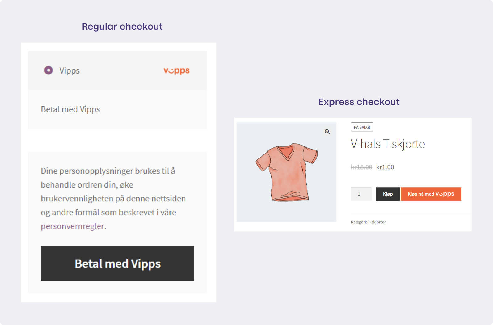
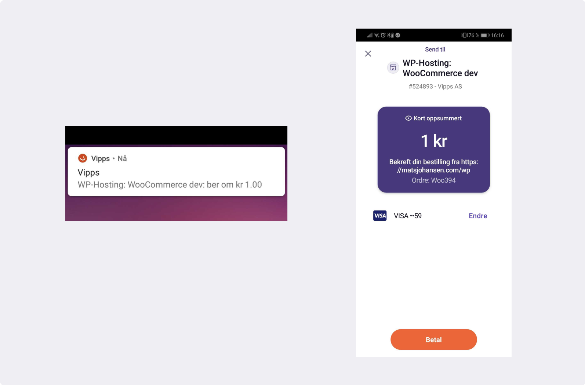
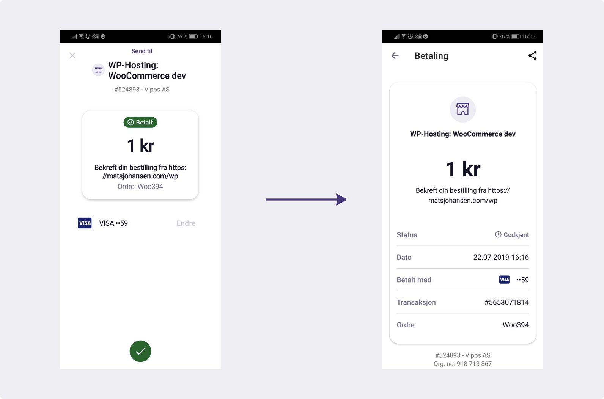
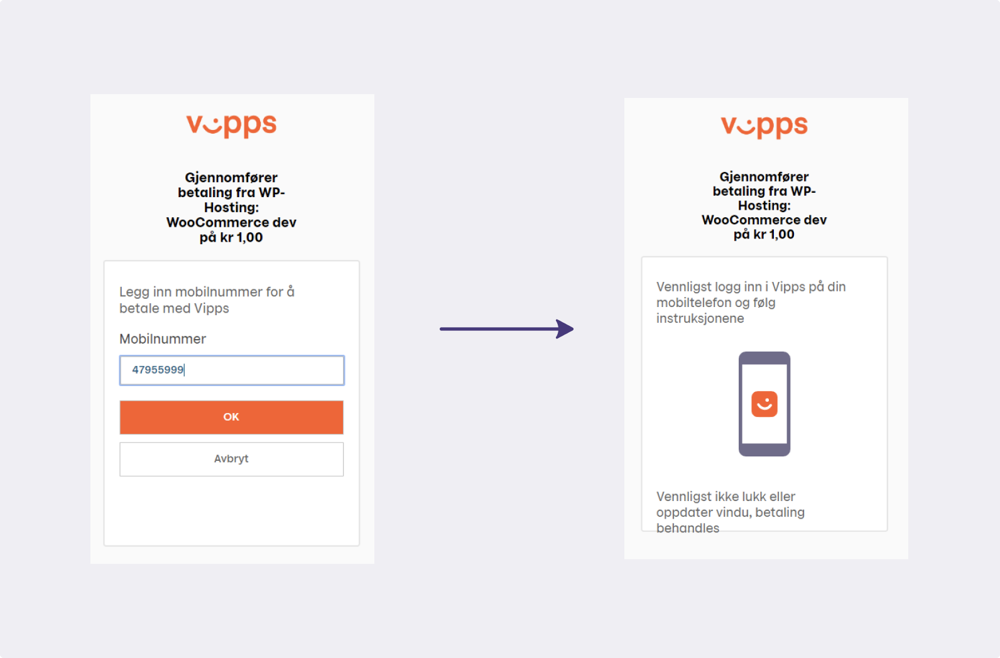

# Vipps eCommerce API

API version: 2.0

Document version 2.0.0.

See: Vipps eCom API [GitHub repository](https://github.com/vippsas/vipps-ecom-api),
with Swagger specifications, Postman collections, example code, integration
checklist and the [FAQ](vipps-ecom-api-faq.md).

# Table of contents

- [API endpoints](#api-endpoints)
- [Initiate](#initiate)
  * [Regular eCommerce payments](#regular-ecommerce-payments)
  * [Express checkout payments](#express-checkout-payments)
  * [Initiate payment flow: Phone and browser](#initiate-payment-flow--phone-and-browser)
      - [Vipps installed](#vipps-installed)
      - [Vipps not installed](#vipps-not-installed)
    + [Desktop browser initiated payments](#desktop-browser-initiated-payments)
      - [Payments initiated in an app](#payments-initiated-in-an-app)
  * [Initiate payment flow: API calls](#initiate-payment-flow--api-calls)
  * [Payment identification](#payment-identification)
  * [orderId recommendations](#orderid-recommendations)
  * [URL Validation](#url-validation)
  * [Callbacks](#callbacks)
    + [Callback endpoints](#callback-endpoints)
    + [Callback examples](#callback-examples)
    + [Authorization for callbacks](#authorization-for-callbacks)
    + [Vipps callback servers](#vipps-callback-servers)
    + [Callback URLs must be reachable](#callback-urls-must-be-reachable)
    + [Callback statuses](#callback-statuses)
  * [Timeouts](#timeouts)
    + [Using a phone](#using-a-phone)
    + [Using a laptop/desktop](#using-a-laptop-desktop)
  * [Express checkout API endpoints required on the merchant side](#express-checkout-api-endpoints-required-on-the-merchant-side)
      - [Get shipping details](#get-shipping-details)
    + [Transaction update](#transaction-update)
    + [Remove User Consent](#remove-user-consent)
  * [Skip landing page](#skip-landing-page)
- [Reserve](#reserve)
  * [The Vipps landing page](#the-vipps-landing-page)
- [Capture](#capture)
  * [Reserve capture](#reserve-capture)
  * [Direct capture](#direct-capture)
  * [Partial capture](#partial-capture)
- [Cancel](#cancel)
- [Refund](#refund)
  * [Recurring eCommerce payments](#recurring-ecommerce-payments)
- [Get payment details](#get-payment-details)
  * [Payment states](#payment-states)
  * [Requests and responses](#requests-and-responses)
  * [Example Get payment details](#example-get-payment-details)
  * [Polling guidelines](#polling-guidelines)
- [Get payment status](#get-payment-status)
- [Authentication](#authentication)
  * [Access token](#access-token)
- [HTTP response codes](#http-response-codes)
- [Idempotency](#idempotency)
  * [Exception handling](#exception-handling)
    + [Connection timeout](#connection-timeout)
    + [Callback aborted or interrupted](#callback-aborted-or-interrupted)
    + [PSP connection issues](#psp-connection-issues)
- [App integration](#app-integration)
  * [App-switch between browser and the Vipps app](#app-switch-between-browser-and-the-vipps-app)
    + [App-switch on iOS](#app-switch-on-ios)
      - [Switch from merchant app to the Vipps app](#switch-from-merchant-app-to-the-vipps-app)
      - [Redirect back to the merchant app from Vipps app](#redirect-back-to-the-merchant-app-from-vipps-app)
        * [Registering a 3rd party app with URL scheme and handling custom URL calls](#registering-a-3rd-party-app-with-url-scheme-and-handling-custom-url-calls)
    + [App-switch on Android](#app-switch-on-android)
      - [Switching from merchant app to the Vipps app](#switching-from-merchant-app-to-the-vipps-app)
      - [Switching back to the merchant app from Vipps app](#switching-back-to-the-merchant-app-from-vipps-app)
        * [Return back to merchant app by actively deeplinking into it from Vipps](#return-back-to-merchant-app-by-actively-deeplinking-into-it-from-vipps)
        * [Redirect back to merchant app by simply closing the Vipps app](#redirect-back-to-merchant-app-by-simply-closing-the-vipps-app)
- [Errors](#errors)
  * [Error object in the response](#error-object-in-the-response)
  * [Error groups](#error-groups)
  * [Error codes](#error-codes)
- [Questions?](#questions-)

# API endpoints

The Vipps eCommerce API (eCom API) offers functionality for online payments.
Payments are supported in both web browsers and in native apps (via deep-linking).

| Operation           | Description         | Endpoint          |
| ------------------- | ------------------- | ----------------- |
| [Initiate payment](#initiate) | Payment initiation, the first request in the payment flow. This _reserves_ an amount. | [`POST:/ecomm/v2/payments`](https://vippsas.github.io/vipps-ecom-api/#/Vipps_eCom_API/initiatePaymentV3UsingPOST)  |
| [Capture payment](#capture) | When an amount has been reserved, and the goods are (about to be) shipped, the payment must be _captured_ | [`POST:/ecomm/v2/payments/{orderId}/capture`](https://vippsas.github.io/vipps-ecom-api/#/Vipps_eCom_API/capturePaymentUsingPOST)  |
| [Cancel payment](#cancel) | The merchant may cancel a reserved amount, but not on a captured amount. | [`PUT:/ecomm/v2/payments/{orderId}/cancel`](https://vippsas.github.io/vipps-ecom-api/#/Vipps_eCom_API/cancelPaymentRequestUsingPUT)  |
| [Refund payment](#refund) | The merchant may refund a captured amount. | [`POST:/ecomm/v2/payments/{orderId}/refund`](https://vippsas.github.io/vipps-ecom-api/#/Vipps_eCom_API/refundPaymentUsingPOST)  |
| [Get payment details](#get-payment-details) | The full history of the payment.  | [`GET:/ecomm/v2/payments/{orderId}/details`](https://vippsas.github.io/vipps-ecom-api/#/Vipps_eCom_API/getPaymentDetailsUsingGET)  |
| Access Token | Fetch the access token | [`POST:/accesstoken/get`](https://vippsas.github.io/vipps-ecom-api/#/Authorization_Service/fetchAuthorizationTokenUsingPost) |
| Get order status    | Deprecated, use [Get payment details](#get-payment-details) | [`GET:/ecomm/v2/payments/{orderId}/details`](https://vippsas.github.io/vipps-ecom-api/#/Vipps_eCom_API/getPaymentDetailsUsingGET) |

See the
[eCom API checklist](https://github.com/vippsas/vipps-ecom-api/blob/master/vipps-ecom-api-checklist.md).

# Initiate

Vipps eCommerce API offers 2 types of payments:
1. Regular eCommerce payments
2. Express checkout payments

Examples from a demo website:



## Regular eCommerce payments

When you initiate a payment it will only be _reserved_ until you capture it.
Vipps supports both _reserve capture_ and _direct capture_ payment flows.

**Reserve capture** is the default. When you initiate a payment it will be
reserved until you capture it.

According to Norwegian regulations you can _not_ capture a payment until
the product or service is provided to the customer. For more information,
please see the Consumer Authority's
[Guidelines for the standard sales conditions for consumer purchases of goods over the internet](https://www.forbrukertilsynet.no/english/guidelines/guidelines-the-standard-sales-conditions-consumer-purchases-of-goods-the-internet).

**Direct capture** causes all payment reservations to be instantly be captured.
This is intended for situations where the product or service is immediately
provided to the customer, e.g. digital services.

Merchants can not choose between _reserve capture_ and _direct capture_
themselves, the type of capture is configured by Vipps after the additional
compliance checks, required by the authorities, have been completed.
See the
[FAQ](https://github.com/vippsas/vipps-ecom-api/blob/master/vipps-ecom-api-faq.md#what-is-the-difference-between-reserve-capture-and-direct-capture).

## Express checkout payments

Express checkout is an solution for letting the user automatically share their
Vipps profile address information with merchant and choose a shipping option.

To perform an express checkout, the merchant needs to send
`"paymentType": "eComm Express Payment"` as part of initiate payment, and
support the `shippingDetails` and `consent` endpoints.

These are payments related to Vipps Hurtigkasse (express checkout), where Vipps
simplifies the purchase process for the customer to a few simple steps:

1. The user clicks the "Vipps Hurtigkasse" button.
2. The user consents to sharing address information in Vipps.
3. The user confirms the amount, delivery address and delivery method in Vipps.

The shipping methods presented to the user is provided by the merchant through
the `shippingDetails` endpoint.

Vipps complies with GDPR, and requires the user's consent before any information
is shared with the merchant. The merchant must provide a URL (`consentRemovalPrefix`)
that Vipps can call to delete the data. The Vipps app allows the user to later
remove this consent (via the Profile -> Security -> "Access to your information"
-> "Companies that remember you" screens).

## Initiate payment flow: Phone and browser

The Vipps landing page will detect if the Vipps native app is installed on the phone.
If the Vipps app is installed, it is automatically opened.

#### Vipps installed

1. Vipps is invoked.
2. The user accepts or rejects the payment request in Vipps.
3. Once payment process is completed, Vipps redirects to the `fallBack` URL that merchant provided earlier (see above).

#### Vipps not installed

1. The user is prompted for the mobile number on the Vipps landing page.
2. Vipps sends a push notification. The landing page is not closed in this case.
3. The user accepts or rejects the payment in Vipps.
4. Once payment process is completed, Vipps redirects to the `fallBack` URL that the merchant provided earlier.

### Desktop browser initiated payments

1. The landing page will be opened in the desktop browser.
2. The landing page will prompt for user’s mobile number.
3. Vipps sends a push notification to corresponding Vipps profile, if it exists.
   The landing page is not closed in this case.
4. The Vipps user accepts or rejects the payment request.
5. Once payment process is completed, the landing page will redirect to the
   `fallBack` URL that merchant provided earlier (see above).

The push notification, and Vipps after opening the notification:



#### Payments initiated in an app

Merchants can signal that the request is coming from their native app by passing
the `isApp:true` parameter. In this case, the Vipps backend returns an URL that
works as a native app deeplink to the Vipps app (eg. with a `vipps://` scheme).

The landing page is not involved in this case, since the merchant app is
expected to use the `vipps://` URL to deeplink straight to the Vipps app.

1. Merchant initiates the payment with `isApp:true` parameter: [`POST:/ecomm/v2/payments`](https://vippsas.github.io/vipps-ecom-api/#/Vipps_eCom_API/initiatePaymentV3UsingPOST).
2. Vipps returns a `deeplink` URL as response to initiate payment.
3. The merchant uses the `vipps://` URL to invoke the Vipps app.
4. Vipps is automatically opened.
5. The user accepts or rejects the payment request in Vipps.
6. When the payment process is completed, Vipps redirects to the merchant using the `fallBack` URL.

## Initiate payment flow: API calls

[`POST:/ecomm/v2/payments`](https://vippsas.github.io/vipps-ecom-api/#/Vipps_eCom_API/initiatePaymentV3UsingPOST)

A minimal example:

```json
{
  "customerInfo": {
  },
  "merchantInfo": {
    "merchantSerialNumber": "123456",
    "callbackPrefix":"https://example.com/vipps/callbacks-for-payment-update",
    "fallBack": "https://example.com/vipps/fallback-result-page/order123abc"
  },
  "transaction": {
    "orderId": "order123abc",
    "amount": 20000,
    "transactionText": "One pair of Vipps socks"
  }
}
```

An express payment example with more parameters provided:

```json
{
  "customerInfo": {
    "mobileNumber": "48059528"
  },
  "merchantInfo": {
    "authToken": "eyJ0eXAiOiJKV1QiLCJhbGciOiJSUzI1Ni <snip>",
    "callbackPrefix": "https://example.com/vipps/callbacks-for-payment-update",
    "consentRemovalPrefix": "https://example.com/vipps/consents/",
    "fallBack": "https://example.com/vipps/fallback-result-page/order123abc",
    "isApp": false,
    "merchantSerialNumber": 123456,
    "shippingDetailsPrefix": "https://example.com/vipps/shipping/",
    "paymentType": "eComm Express Payment",
    "staticShippingDetails": [
        {
            "isDefault": "N",
            "priority": 1,
            "shippingCost": 30.0,
            "shippingMethod": "Walking",
            "shippingMethodId": "123abc"
        },
        {
            "isDefault": "Y",
            "priority": 2,
            "shippingCost": 30.0,
            "shippingMethod": "Running",
            "shippingMethodId": "321abc"
        }
    ]
  },
  "transaction": {
    "amount": 20000,
    "orderId": "order123abc",
    "timeStamp": "2018-12-12T11:18:38.246Z",
    "transactionText": "One pair of Vipps socks"
  }
}
```

Example: Response body for `"isApp":false`:

```json
{
    "orderId": "order123abc",
    "url": "https://api.vipps.no/deeplink/vippsgateway?token=eyJraWQiOiJqd3R <snip>"
}
```
Example: Response body for `"isApp":true`:

```json
{
    "orderId": "order123abc",
    "url": "vipps://?token=eyJraWQiOiJqd3RrZXkiLCJhbGciOiJSUzI1NiJ9.eyJzdWIi <snip>"
}
```

The `url` is slightly simplified, but the format is correct.

The URL depends on whether the `initiate` request was provided the `isApp` parameter:
* For `true`, the URL is for an deeplink to the Vipps app.
* For `false` or not provided, the URL is for the Vipps "landing page".

## Payment identification

A payment is uniquely identified by the combination of `merchantSerialNumber`
and `orderId`:

* `merchantSerialNumber`: The merchant's Vipps id. Example: `123456`.
* `orderId`: Must be unique for the `merchantSerialNumber`. Example: `order123abc`.

To initiate an express checkout payment the payment initiation call must include
the `"paymentType": "eComm Express Payment"` parameter. If this parameter is not
passed, the payment type will default to regular payment.

## orderId recommendations

A `orderId` must be unique for the MSN (Merchant Serial Number, the id of
the sale unit). The `orderId` does not need to be globally unique, so several
MSNs may use the same `orderId`, as long as it is unique for each sale unit.

While the minimum length for `orderId` is 1, we recommend
using at least 6 characters, and a combination of numbers and characters.

The maximum length of an `orderId` is 30 alphanumeric characters:
a-z, A-Z, 0-9 and '-'.

Leading zeros should be avoided, as some applications (like Excel)
tend to remove them, and this may cause misunderstandings.

We _strongly_ recommend to use `orderId` format that makes it easy to
search for them in logs. This means that `abc-123-def-456` is a better
format than `123456`.

With multiple sale units, prefixing the `orderId` with the MSN
for each sale unit is recommended: If the MSN is `654321`, the
`orderId`s could start at `654321-0000-0000-0001` and increment by 1
for each order, or some similar, unique and readable pattern.


## URL Validation

All URLs in Vipps eCommerce API are validated with the
[Apache Commons UrlValidator](https://commons.apache.org/proper/commons-validator/apidocs/org/apache/commons/validator/routines/UrlValidator.html).

If `isApp` is true, the `fallBack` is not validated with Apache Commons UrlValidator,
as the app-switch URL may be something like `vipps://`, which is not a valid URL.

The endpoints required by Vipps must be publicly available.

URLs that start with `https://localhost` will be rejected. If you want to use
localhost as fallback, please use `http://127.0.0.1`.
It is, naturally, not possible to use `https://localhost` or
`http://127.0.0.1` for the callback, as the Vipps backend would then call itself.

Here is a simple Java class suitable for testing URLs,
using the dummy URL `https://example.com/vipps/fallback-result-page/order123abc`:

```java
import org.apache.commons.validator.routines.UrlValidator;

public class UrlValidate {
 public static void main(String[] args) {
  UrlValidator urlValidator = new UrlValidator();

  if (urlValidator.isValid("https://example.com/vipps/fallback-result-page/order123abc")) {
   System.out.println("URL is valid");
  } else {
   System.out.println("URL is invalid");
  }
 }
}
```


## Callbacks

Callbacks allow Vipps to send the payment order details to the merchant,
and normally offer at better (and faster) user experience than relying on
polling
[GET:/ecomm/v2/payments/{orderId}/details](https://vippsas.github.io/vipps-ecom-api/#/Vipps_eCom_API/getPaymentDetailsUsingGET).

The callback body depends whether the payment type is set to
`"eComm Regular Payment"` or `"eComm Express Payment"`:

* `"eComm Regular Payment"`: The callback contains the order and transaction details.
* `"eComm Express Payment"`: The callback contains the order and transaction details
  _and in addition_ the user details and shipping details.

The callback will be performed _only once_ during a payment process: When the
payment is successful, fails, is rejected or times out.

If the communication is broken during the process for some reason, and Vipps
is not able to execute callback to the merchant's server, the callback will
not be retried. In other words, if the merchant does not receive any
confirmation on the payment request, the merchant must call
[GET:/ecomm/v2/payments/{orderId}/details](https://vippsas.github.io/vipps-ecom-api/#/Vipps_eCom_API/getPaymentDetailsUsingGET)
to get the status of the payment.

To add authentication to the callbacks made by Vipps to the merchant,
the merchant may provide an `authToken`. This token will then be returned as
an `Authorization` header in the callback and shipping details requests made by
Vipps for that order. Please not that this is unrelated to the authentication
required by the Vipps API.

### Callback endpoints

The callback URLs are generated by taking a field from the payment initiation request from the merchant in
[`POST:/ecomm/v2/payments/{orderId}`](https://vippsas.github.io/vipps-ecom-api/#/Vipps_eCom_API/transactionUpdateCallbackForRegularPaymentUsingPOST),
and then adding a suffix. See the "Endpoints required by Vipps" section in the [Swagger documentation](https://vippsas.github.io/vipps-ecom-api/#/).

| Endpoint	| Field | Description |
| ----------- | ----------- | ----------- |
| [`POST:[callbackPrefix]/v2/payments/{orderId}`](https://vippsas.github.io/vipps-ecom-api/#/Endpoints_required_by_Vipps_from_the_merchant/transactionUpdateCallbackForRegularPaymentUsingPOST) | callbackPrefix | Status update sent from Vipps |
| [`POST:[shippingDetailsPrefix]/v2/payments/{orderId}/shippingDetails`](https://vippsas.github.io/vipps-ecom-api/#/Endpoints_required_by_Vipps_from_the_merchant/fetchShippingCostUsingPOST) | shippingDetailsPrefix | Request for getting shipping details. ([Express checkout](#express-checkout-api-endpoints-required-on-the-merchant-side) functionality) |
| [`DELETE:[consentRemovalPrefix]/v2/consents/{userId}`](https://vippsas.github.io/vipps-ecom-api/#/Endpoints_required_by_Vipps_from_the_merchant/removeUserConsentUsingDELETE) | consentRemovalPrefix | User has removed consent for sharing details. ([Express checkout](#express-checkout-api-endpoints-required-on-the-merchant-side) functionality) |

### Callback examples

Examples of [`POST:[callbackPrefix]/v2/payments/{orderId}`](https://vippsas.github.io/vipps-ecom-api/#/Endpoints_required_by_Vipps_from_the_merchant/transactionUpdateCallbackForRegularPaymentUsingPOST).

Example: `"eComm Regular Payment"` callback:

```json
{
  "merchantSerialNumber": 123456,
  "orderId": "order123abc",
  "transactionInfo": {
    "amount": 20000,
    "status": "RESERVED",
    "timeStamp": "2018-12-12T11:18:38.246Z",
    "transactionId": "5001420062"
  }
}
```

Example: `"eComm Express Payment"` callback:

```json
{
  "merchantSerialNumber": 123456,
  "orderId": "order123abc",
  "shippingDetails": {
    "address": {
      "addressLine1": "Dronning Eufemias gate 42",
      "addressLine2": "Att: Rune Garborg",
      "city": "Oslo",
      "country": "Norway",
      "postCode": "0191"
    },
    "shippingCost": 109.99,
    "shippingMethod": "By cannon"
  },
  "transactionInfo": {
    "amount": 20000,
    "status": "RESERVE",
    "timeStamp": "2018-12-12T11:18:38.246Z",
    "transactionId": "5001420062"
  },
  "userDetails": {
    "bankIdVerified": "Y",
    "dateOfBirth": "12-3-1988",
    "email": "user@example.com",
    "firstName": "Ada",
    "lastName": "Lovelace",
    "mobileNumber": "12345678",
    "ssn": "12345678901",
    "userId": "1234567"
  }
}
```

### Authorization for callbacks

If `authToken` was used in the initiate payment request these requests will
have a `Authorization` header. These headers will have the same value as the
one provided in `authToken`.

API details: [`POST:[callbackPrefix]/v2/payments/{orderId}`](https://vippsas.github.io/vipps-ecom-api/#/Endpoints_required_by_Vipps_from_the_merchant/transactionUpdateCallbackForRegularPaymentUsingPOST)

### Vipps callback servers

The callbacks from Vipps are made from the servers described in
[Vipps request servers](https://github.com/vippsas/vipps-developers#vipps-request-servers).

Please make sure that requests from these servers are allowed through firewalls, etc.

**Please note:** Vipps may change the IP addresses that we make callbacks from. To
ensure that you are whitelisting the corrects IP addresses please use these
hostnames.  

### Callback URLs must be reachable

Please make sure that the callback URLs are reachable:

* Vipps does _not_ support sending requests to all ports, so to be safe use
  common port numbers such as: 80, 443, 8080.
* Vipps does _not_ support callback URLs that return `HTTP 301 Redirect` or
  `HTTP 302 Permanently Moved`. The callback URLs _must_ be directly reachable.

### Callback statuses

These are the statuses provided by Vipps in the callbacks by
[`[callbackPrefix]/v2/payments/{orderId}`](https://vippsas.github.io/vipps-ecom-api/#/Endpoints_required_by_Vipps_from_the_merchant/transactionUpdateCallbackForRegularPaymentUsingPOST):

| Callback         | Response         | Description                                 |
| ---------------- | ---------------- | ------------------------------------------- |
| Regular checkout | `RESERVED`       | Payment reserved, by user accepting the payment in Vipps |
|                  | `SALE`           | Payment captured with direct capture, by merchant (after `RESERVED`)  |
|                  | `RESERVE_FAILED` | Reserve failed because of insufficient funds, invalid card, or similar |
|                  | `SALE_FAILED`    | Direct failed because of insufficient funds, invalid card, or similar |
|                  | `CANCELLED`      | Payment canceled, by user in Vipps |
|                  | `REJECTED`       | User did not act on the payment (timeout, etc) |
| Express checkout | `RESERVE`        | Payment reserved, by user accepting the payment in Vipps (it _is_ correct that this is different from `RESERVED` for regular checkout - sorry)|
|                  | `SALE`           | Payment captured with direct capture, by merchant (after `RESERVE`)  |
|                  | `CANCELLED`      | Payment canceled, by user in Vipps  |
|                  | `REJECTED`       | User did not act on the payment (timeout, etc)  |

See also: [Get payment details](#get-payment-details).

## Timeouts

### Using a phone

Both the deeplink URL, which causes the app-switch to Vipps, and the landing
page displayed in browsers, is valid for 5 minutes.

If the user does not act on the app-switch (such as not attempting to log into
Vipps) within 5 minutes, the payment times out.

After the app-switch to Vipps, the user has another 5 minutes to complete the
payment in Vipps.

This means that the user has a total of 10 minutes to complete the payment.

### Using a laptop/desktop

If the user is using a laptop/desktop device, and the user must confirm or
enter the phone number on the landing page within 5 minutes.
If the user does not do so, the payment times out.

After the user has clicked "OK" on the landing page, the user
has an additional 5 minutes to complete the payment in Vipps.

This means that the user has a total of 10 minutes to complete the payment.


## Express checkout API endpoints required on the merchant side

The below endpoints are provided by the _merchant_ and consumed by Vipps during express checkout payments.
These endpoints are included in the Swagger file for reference.

| Operation           | Description         | Endpoint          |
| ------------------- | ------------------- | ----------------- |
| Get shipping details | Used to fetch shipping information, **10 second timeout** | [`POST:/v2/payments/{orderId}/shippingDetails`](https://vippsas.github.io/vipps-ecom-api/#/Endpoints_required_by_Vipps_from_the_merchant/fetchShippingCostUsingPOST)  |
| Transaction Update | A callback to the merchant for receiving post-payment information. | [`POST:/v2/payments/{orderId}`](https://vippsas.github.io/vipps-ecom-api/#/Endpoints_required_by_Vipps_from_the_merchant/transactionUpdateCallbackForRegularPaymentUsingPOST)  |
| Remove user consent | Used to inform merchant when the Vipps user removes consent to share information.  | [`DELETE:/v2/consents/{userId}`](https://vippsas.github.io/vipps-ecom-api/#/Endpoints_required_by_Vipps_from_the_merchant/removeUserConsentUsingDELETE)  |

The following endpoints are to be implemented by merchants, in order for Vipps to make calls to them.
The documentation is included in the Swagger file for reference only - these endpoints are _not_ callable at Vipps.

#### Get shipping details

This API call is for express payments, and allows Vipps to get the shipping
cost and method based on the provided address and product details. This is only
relevant for express checkout payments where Vipps needs to present shipping
cost and method to the Vipps user.
This service must be implemented by the merchant.

Swagger: [`POST:[shippingDetailsPrefix]/v2/payments/{orderId}/shippingDetails`](https://vippsas.github.io/vipps-ecom-api/#/Endpoints_required_by_Vipps_from_the_merchant/fetchShippingCostUsingPOST)


Request:

```json
{
    "addressId": 3960,
    "addressLine1": "Dronning Eufemias gate 42",
    "addressLine2": null,
    "country": "Norway",
    "city": "OSLO",
    "postCode": "0191",
    "addressType": "H",
}
```

Response:

```json
{
    "addressId": 3960,
    "orderId": "123456abc",
    "shippingDetails": [
        {
            "isDefault": "N",
            "priority": 1,
            "shippingCost": 30.0,
            "shippingMethod": "Walking",
            "shippingMethodId": "123abc"
        },
        {
            "isDefault": "Y",
            "priority": 2,
            "shippingCost": 30.0,
            "shippingMethod": "Running",
            "shippingMethodId": "321abc"
        }
    ]
}
```

### Transaction update

A callback to the merchant for receiving post-payment information:
[`POST:/v2/payments/{orderId}`](https://vippsas.github.io/vipps-ecom-api/#/Endpoints_required_by_Vipps_from_the_merchant/transactionUpdateCallbackForRegularPaymentUsingPOST).

### Remove User Consent

[`DELETE:[consetRemovalPrefix]/v2/consents/{userId}`](https://vippsas.github.io/vipps-ecom-api/#/Endpoints_required_by_Vipps_from_the_merchant/removeUserConsentUsingDELETE)

This allows Vipps to send an end user's consent removal request to merchant.
This endpoint is required for express checkout. When receiving this request,
the merchant is obliged to handle the user details as per the GDPR guidelines.
The request path will include a `userId` that Vipps will have provided as
part of callback, and also made accessible through [`GET:/ecomm/v2/payments/{orderId}/details`](https://vippsas.github.io/vipps-ecom-api/#/Vipps_eCom_API/getPaymentDetailsUsingGET).

## Skip landing page

*Only available for whitelisted sale units.*

If the `skipLandingPage` property is set to `true` in the
[`POST:/ecomm/v2/payments`](https://vippsas.github.io/vipps-ecom-api/#/Vipps%20eCom%20API/initiatePaymentV3UsingPOST)
call, it will cause a push notification to be sent to the given phone number
immediately, without loading the landing page.

If the sale unit is not whitelisted, this property is ignored.

If you need to be whitelisted, instructions for this can be found in the
[FAQ](https://github.com/vippsas/vipps-psp-api/blob/master/vipps-psp-api-faq.md#is-it-possible-to-skip-the-landing-page).


# Reserve



When the user confirms, the payment status changes to `RESERVE`.
The respective amount will be reserved for future capturing.

## The Vipps landing page



When a user has selected Vipps for payment, the Vipps landing page
detects whether user is using a desktop browser or a mobile browser:

* In a mobile browser, the landing page detects if the Vipps app is installed,
  and automatically switches to the Vipps app if it is.
* In a desktop browser, the landing page prompts the user for the phone number (the number may also be pre-filled).
  The user enters or confirms the phone number. Then on their phone, the user gets a push notification and the Vipps app then prompts for confirmation.

The Vipps landing page is mandatory, and provides a consistent and recognizable user experience,
that helps guide the user through the payment flow.
In this way Vipps takes responsibility for helping the user from the browser to the app,
and to complete the payment in a familiar way.

The user's phone number can be set in the payment initiation call:
[`POST:/ecomm/v2/payments`](https://vippsas.github.io/vipps-ecom-api/#/Vipps%20eCom%20API/initiatePaymentV3UsingPOST).

The user's phone number is remembered by the user's browser,
eliminating the need for re-typing it on subsequent purchases.

See also: [Skip landing page](#skip-landing-page).

# Capture

## Reserve capture

_Reserve capture_ is the normal flow.

When then end user approves an initiated payment it will be reserved until you capture it. When the order is reserved
the amount is marked as reserved by the bank, but not transferred.

## Direct capture

When _direct capture_ is activated, all payment reservations will instantly be captured.

When doing _direct capture_ Vipps is responsible for the customer receiving the purchased product.
Because of this, _direct capture_ requires additional compliance checks, and the following
requirements apply:
* The merchant must have an annual revenue of more than 10 million NOK
* The merchant must have a Key Account Manager (KAM) in Vipps
* The merchant must have a partner that is responsible for the Vipps integration

To request _direct capture_, please contact your KAM.

Capture payment allows the merchant to capture the reserved amount.
The API allows for both a _full amount capture_ and a _partial amount capture_.

The amount to capture cannot be higher than the reserved amount. According to
Norwegian regulations, capture can not be done before the goods have been shipped.
The transaction text is mandatory, and is displayed to end user in Vipps.

## Partial capture

Partial capture may be used if not the entire order is shipped or for other
reasons. Partial capture may be called as many times as required as long as
there is a remaining reserved amount to capture.

If one or more partial captures have been made, the remaining amount
(if there is one) will be automatically refunded after a few days.
See the FAQ for
[details](https://github.com/vippsas/vipps-ecom-api/blob/master/vipps-ecom-api-faq.md#for-how-long-is-an-initiated-payment-reserved).
It is not possible to refund the remaining amount (since it has not been captured),
and it is not possible to cancel the reservation, since some of it has been captured.

There is only a need to specify the `amount` when doing a partial capture.
To perform capture of the entire amount `amount` can be set to `null` or `0`

These two truncated examples show the responses for a reservation of
200.00 NOK, and a partial capture of 100.00 NOK:

```json
"transactionSummary": {
    "capturedAmount": 20000,
    "remainingAmountToCapture": 0,
    "refundedAmount": 0,
    "remainingAmountToRefund": 0
}
```

```json
"transactionsummary": {
    "capturedAmount": 10000,
    "remainingAmountToCapture": 10000,
    "refundedAmount": 0,
    "remainingAmountToRefund": 0
}
```

# Cancel

Reservations can be cancelled, and the payment flow aborted, under certain circumstances:

* When the user cancels (rejects) the initiated payment in the Vipps app.
* Timeouts: If the user does not confirm, etc.

Partially captured reservations can not be cancelled.

After cancellation, the order gets a new status:
* If an order is cancelled by the merchant, it gets the status `VOID`.
* If an order is cancelled by the user, it gets the status `CANCEL`.

Swagger: [`PUT:/ecomm/v2/payments/order123abc/cancel`](https://vippsas.github.io/vipps-ecom-api/#/Vipps_eCom_API/cancelPaymentRequestUsingPUT)

Request:

```json
{
  "merchantInfo": {
    "merchantSerialNumber": "123456"
  },
  "transaction": {
    "transactionText": "No socks for you!"
  }
}
```

Response:

```json
{
    "orderId": "order123abc",
    "transactionInfo": {
        "amount": 20000,
        "transactionText": "No socks for you!",
        "status": "Cancelled",
        "transactionId": "5001420063",
        "timeStamp": "2018-11-14T15:31:10.004Z"
    },
    "transactionSummary": {
        "capturedAmount": 0,
        "remainingAmountToCapture": 0,
        "refundedAmount": 0,
        "remainingAmountToRefund": 0
    }
}
```

# Refund

The merchant can initiate a refund of the captured amount.
The refund can be a partial or full.

Partial refunds are done by specifying an `amount` which is lower than the captured amount.
The refunded amount cannot be larger than the captured amount.

In a capture request the merchant may also use the `X-Request-Id`header. This header is an idempotency header ensuring that if the merchant retries a request with the same `X-Request-Id` the retried request will not make additional changes.

Swagger: [`POST:/ecomm/v2/payments/order123abc/refund`](https://vippsas.github.io/vipps-ecom-api/#/Vipps_eCom_API/refundPaymentUsingPOST)

Request:

```json
{
    "merchantInfo": {
        "merchantSerialNumber": "123456"
    },
    "transaction": {
        "amount": 20000,
        "transactionText":"Refund of Vipps socks"
    }
 }
```

Response:

```json
{
    "orderId": "order123abc",
    "transaction": {
        "amount": 20000,
        "transactionText": "Refund of Vipps socks",
        "status": "Refund",
        "transactionId": "5600727726",
        "timeStamp": "2018-11-14T15:23:02.286"
    },
    "transactionSummary": {
        "capturedAmount": 20000,
        "remainingAmountToCapture": 0,
        "refundedAmount": 20000,
        "remainingAmountToRefund": 0
    }
}
```

## Recurring eCommerce payments

Recurring eCommerce is its own seperate product and can be found descriped in details in
our [Recurring Repo.](https://github.com/vippsas/vipps-recurring-api)


# Get payment details

Retrieves the full history of a payment, and whether the operations were
successful or not.

Swagger: [`GET:/ecomm/v2/payments/{orderId}/details`](https://vippsas.github.io/vipps-ecom-api/#/Vipps%20eCom%20API/getPaymentDetailsUsingGET)

## Payment states

| #   | From-state | To-state | Description                                   | Operation |
| --- | ---------- | -------- | --------------------------------------------- | -------------- |
| 0   | -          | Initiate | Payment initiation                            | `INITIATE`     |
| 1   | Initiate   | -        | The merchant has initiated the payment        | `INITIATE`     |
| -   |            | Reserve  | The user has accepted the payment and amount has been reserved | `RESERVE`      |
| -   |            | Cancel   | The user cancels the order                    | `CANCEL`       |
| 2   | Reserve    | Capture  | The merchant captures the payment, and ships  | `CAPTURE`      |
| -   |            | Cancel   | The merchant cancels the order                | `VOID`         |
| 3   | Capture    | --       | A final state: Payment fully processed        | `CAPTURE`      |
| -   |            | Refund   | The merchant refunds the money to the user    | `REFUND`     |
| 4   | Cancel     | --       | A final state: Payment cancelled              | -              |
| 5   | Refund     | --       | A final state: Payment refunded               | -              |

## Requests and responses

Please note that the response from
[`GET:/ecomm/v2/payments/{orderId}/details`](https://vippsas.github.io/vipps-ecom-api/#/Vipps_eCom_API/getPaymentDetailsUsingGET))
always contain _the entire history_ of payments for the order, not just the current status.
The `operationSuccess` filed indicates whether an operation was successful or not.

| Request    | Response |
| ---------- | --------------------------------------------------------- |
| `INITIATE` | Payment initiated, by merchant |
| `RESERVE`  | Payment reserved, by user accepting the payment in Vipps |
| `CAPTURE`  | Payment captured, by merchant (after `RESERVE`) |
| `REFUND`   | Payment refunded, by merchant (after `CAPTURE`) |
| `CANCEL`   | Payment canceled, by user in Vipps |
| `SALE`     | Payment captured with direct capture, by merchant |   
| `VOID`     | Payment canceled, by merchant |

## Example Get payment details

```json
{
    "orderId": "order123abc",
    "transactionSummary": {
        "capturedAmount": 20000,
        "remainingAmountToCapture": 0,
        "refundedAmount": 20000,
        "remainingAmountToRefund": 0
    },
    "transactionLogHistory": [
        {
            "amount": 20000,
            "transactionText": "Refund of Vipps socks",
            "transactionId": "5600727726",
            "timeStamp": "2018-11-14T15:23:02.286Z",
            "operation": "REFUND",
            "requestId": "1542208972",
            "operationSuccess": true
        },
        {
            "amount": 20000,
            "transactionText": "One pair of Vipps socks",
            "transactionId": "5001420058",
            "timeStamp": "2018-11-14T15:22:46.680Z",
            "operation": "CAPTURE",
            "requestId": "1542208966",
            "operationSuccess": true
        },
        {
            "amount": 20000,
            "transactionText": "One pair of Vipps socks",
            "transactionId": "5001420062",
            "timeStamp": "2018-11-14T15:21:22.126Z",
            "operation": "RESERVE",
            "requestId": "",
            "operationSuccess": true
        },
        {
            "amount": 20000,
            "transactionText": "One pair of Vipps socks",
            "transactionId": "5001420062",
            "timeStamp": "2018-11-14T15:21:04.697Z",
            "operation": "INITIATE",
            "requestId": "",
            "operationSuccess": true
        }
    ]
}
```

**Please note:** The `transactionSummary` will not be part of the response if
the user not reacted to the Vipps landing page or app-switch.

## Polling guidelines

General guidelines for When to start polling with
[`GET:/ecomm/v2/payments/{orderId}/details`](https://vippsas.github.io/vipps-ecom-api/#/Vipps%20eCom%20API/getPaymentDetailsUsingGET):

1. Start after 5 seconds
2. Check every 2 seconds

These are reasonable values, but different merchants have different use cases,
and values should be adapted to the specific case.

See [Timeouts](#timeouts) for details about timeouts.

# Get payment status

**IMPORTANT: This endpoint is deprecated. Use [Get payment details](#get-payment-details).**

| Request                              | Response "Status" or "Operation" |
| ------------------------------------ | -------------------------------- |
| [`GET:/ecomm/v2/payments/{orderId}/status`](https://vippsas.github.io/vipps-ecom-api/#/Vipps_eCom_API/getOrderStatusUsingGET)  | **This endpoint is deprecated, please use:** [`GET:/ecomm/v2/payments/{orderId}/details`](https://vippsas.github.io/vipps-ecom-api/#/Vipps_eCom_API/getPaymentDetailsUsingGET) |
|   |  `INITIATE`  -  Merchant initiates the transaction. Stage-1, Status - 101. |
|   |  `REGISTER`  - Vipps registers payment for Reserve. Stage-2, Stage-3, Status - 101.|
|   |  `RESERVE` -  Payment Reserved by user accepting transaction in App. Stage-3, Status - 101. |
|   |  `SALE` - Payment Captured with direct capture. Stage-4, status - 101. |
|   |  `CAPTURE` - Payment Captured when merchant called for capture - Stage-6, Status - 101. |
|   |  `REFUND` - Payment refunded when merchant called for refund - Stage-7, Status - 101. |
|   |  `CANCEL` - Payment cancel status when user canceled payment in App. |
|   |  `VOID` - Payment cancel status when merchant calls for cancel API. |
|   |  `FAILED` - Payment failed failed because of no coverage, outdated card details or similar. - Status - 102. |
|   |  `REJECTED` - No user action in the Vipps app, i.e timeout. |

# Authentication

All API calls are authenticated and authorized based on the application access
token (JWT bearer token) and a subscription key (`Ocp-Apim-Subscription-Key`),
and these headers are required:

| Header Name | Header Value | Description |
| ----------- | ------------ | ----------- |
| `Authorization` | `Bearer <JWT access token>` | Type: Authorization token. This is available on [portal.vipps.no](https://portal.vipps.no). |
| `Ocp-Apim-Subscription-Key` | Base 64 encoded string | The subscription key for the eCom API. This is available on [portal.vipps.no](https://portal.vipps.no). |

## Access token

The Access Token API provides the JWT bearer token:
[`POST:/accesstoken/get`](https://vippsas.github.io/vipps-ecom-api/#/Authorization_Service/fetchAuthorizationTokenUsingPost).

Request:

```http
POST https://apitest.vipps.no/accessToken/get
client_id: <client_id>
client_secret: <client_secret>
Ocp-Apim-Subscription-Key: <Ocp-Apim-Subscription-Key>
```

(We are aware that this is a `POST`, without a body, to an endpoint with
`get` in the URL, and hope to fix it in a later version of the API.)

All headers are unique per `merchantSerialNumber` and can be found on [portal.vipps.no](https://portal.vipps.no).

| Header Name | Header Value | Description |
| ----------- | ------------ | ----------- |
| `client_id` | A GUID value | Client ID for the merchant |
| `client_secret` | Base 64 encoded string | Client Secret for the merchant |
| `Ocp-Apim-Subscription-Key` | Base 64 encoded string | Subscription key for the product |

For the subscription `Vipps-eCommerce-Services-API` the `Ocp-Apim-Subscription-Key`
for an access token request will be the same as for eCommerce requests. While
for other subscriptions they will use different keys. See
[getting started](https://github.com/vippsas/vipps-developers/blob/master/vipps-getting-started.md)
for more details.

Response:

````http
HTTP 200 OK
````

```json
{
  "token_type": "Bearer",
  "expires_in": "86398",
  "ext_expires_in": "0",
  "expires_on": "1495271273",
  "not_before": "1495184574",
  "resource": "00000002-0000-0000-c000-000000000000",
  "access_token": "eyJ0eXAiOiJKV1QiLCJhbGciOiJSUzI1Ni <snip>"
}
```

JWT properties:

| Name                        | Description                                 |
| --------------------------- | ------------------------------------------- |
| `Bearer`                    | It’s a `Bearer` token. The word `Bearer` should be added before the token |
| `expires_in`                | Token expiry duration in seconds. |
| `ext_expires_in`            | Extra expiry time. Not used. |
| `expires_on`                | Token expiry time in epoch time format. |
| `not_before`                | Token creation time in epoch time format. |
| `resource`                  | For the product for which token has been issued. |
| `access_token`              | The actual access token that needs to be used in `Authorization` request header. |

**Please note:** The access token is valid for 1 hour in MT (Merchant Test)
and 24 hours in Production. To be sure that you are using correct time please
use `expires_in` or `expires_on`.

Example of an error response body (formatted for readability):

```json
{
  "error": "unauthorized_client",
  "error_description":
    "AADSTS70001: Application with identifier 'e9b6c99d-2442-4a5d-84a2-\
     c53a807fe0c4' was not found in the directory testapivipps.no\
     Trace ID: 3bc2b2a0-d9bb-4c2e-8367- 5633866f1300\r\nCorrelation ID:\
     bb2f4093-70af-446a-a26d-ed8becca1a1a\r\nTimestamp: 2017-05-19 09:21:28Z",
  "error_codes": [ 70001 ],
  "timestamp": "2017-05-19 09:21:28Z",
  "trace_id": "3bc2b2a0-d9bb-4c2e-8367-5633866f1300",
  "correlation_id": "bb2f4093-70af-446a-a26d-ed8becca1a1a"
}
```

# HTTP response codes

This API returns the following HTTP statuses in the responses.
See the [Swagger specification](./) for more details.

| HTTP status             | Description                                             |
| ----------------------- | ------------------------------------------------------- |
| `200 OK`                | Request successful                                      |
| `201 Created`           | Request successful, resource created                    |
| `204 No Content`        | Request successful, but empty result                    |
| `400 Bad Request`       | Invalid request, see the error for details              |
| `401 Unauthorized`      | Invalid credentials                                     |
| `403 Forbidden`         | Authentication ok, but credentials lacks authorization  |
| `404 Not Found`         | The resource was not found                              |
| `409 Conflict`          | Unsuccessful due to conflicting resource                |
| `429 Too Many Requests` | There is currently a limit of max 200 calls per second  |
| `500 Server Error`      | An internal Vipps problem.                              |

HTTP requests that are being stopped in the application gateway will result in
an error JSON object, while requests that are produced from the backend will
receive an array with a JSON object. Error codes that are produced from the
application gateway include `401`, `403` and `422`.

See [Errors](#errors).

# Idempotency

In a capture request the merchant may also use the `X-Request-Id`header.
This header is an idempotency header ensuring that if the merchant retries
a request with the same `X-Request-Id` the retried request will not make
additional changes.

Request:

[`POST:/ecomm/v2/payments/order123abc/capture`](https://vippsas.github.io/vipps-ecom-api/#/Vipps_eCom_API/capturePaymentUsingPOST)

```json
{
    "merchantInfo": {
        "merchantSerialNumber": "123456"
    },
    "transaction": {
        "amount": 20000,
        "transactionText":"Socks on the way! Tracking code: abc-tracking-123"
    }
 }
```

Response:

```json
{
    "orderId": "order123abc",
    "transactionInfo": {
        "amount": 20000,
        "timeStamp": "2018-11-14T15:22:46.736Z",
        "transactionText": "Socks on the way! Tracking code: abc-tracking-123",
        "status": "Captured",
        "transactionId": "5001420058"
    },
    "transactionSummary": {
        "capturedAmount": 20000,
        "remainingAmountToCapture": 0,
        "refundedAmount": 0,
        "remainingAmountToRefund": 20000
    }
}
```

## Exception handling

The section below explains how Vipps handles different exception and errors.

See also [Errors](#errors).

### Connection timeout

Defining a socket timeout period is the common measure to protect server
resources and is expected. However, the time needed to fulfil a service requests
depends on several systems, which impose longer timeout period than usually
required.

We recommend setting no less than 1 second socket connection timeout
and 5 seconds socket read timeout while communicating with Vipps.

A good practice is, if/when the socket read timeout occurs, to call
[`GET:/ecomm/v2/payments/{orderId}/details`](https://vippsas.github.io/vipps-ecom-api/#/Vipps_eCom_API/getPaymentDetailsUsingGET)
and check status of last transaction in transaction history prior
to executing the service call again.

### Callback aborted or interrupted

If the communication is broken during payment process for some reason, and
Vipps is not able to execute callback, then callback will not be retried.

In other words, if the merchant doesn’t receive any confirmation on payment
request call within callback timeframe, merchant should call
[`GET:/ecomm/v2/payments/{orderId}/details`](https://vippsas.github.io/vipps-ecom-api/#/Vipps_eCom_API/getPaymentDetailsUsingGET)
to get the response of payment request.

### PSP connection issues

In cases of communication problems with Vipps' PSP, the response from Vipps
will be an error (see [Errors](#errors)).

The merchant should then call
[`GET:/ecomm/v2/payments/{orderId}/details`](https://vippsas.github.io/vipps-ecom-api/#/Vipps_eCom_API/getPaymentDetailsUsingGET)
to check if the transaction request is processed before making a new call,
using same idempotency key (see [Idempotency](#idempotency)).

# App integration

Merchants may implement deep-linking, to trigger the Vipps app (we refer to this as "app-switch" here).

This may be done in two ways:

1. From a mobile or desktop browser
2. From an iOS or Android native app

After the user has finished (or cancelled) the payment in the Vipps app, the user is returned back to the browser or native app that started the payment flow (via a the fallback URL provided by the merchant when the order is created). The merchant app or website should then query the ecom API for the updated state of the payment operation.

**Please note:** When the user arrives back in the merchant app or website, we
_strongly_ recommend that you perform a call to the eCom API to check the state
of the transaction. While some of the state of the eCom operation *can* be
derived from things like wether or not user returned successfully from the
native app, the most reliable approach to know the state of the payment flow
is always to query the eCom API once you arrive back in the merchant app/website:
[`GET:/ecomm/v2/payments/{orderId}/details`](https://vippsas.github.io/vipps-ecom-api/#/Vipps_eCom_API/getPaymentDetailsUsingGET).

The sections below explain in more detail how to integrate for browsers and apps.

## App-switch between browser and the Vipps app

For mobile and desktop browsers, integration is handled by Vipps using the Vipps landing page.

The merchant needs to provide a valid `fallBack` URL.
When Vipps has completed the operation, the `fallBack` URL will be opened in the browser.
To maintain the session, the merchant can pass along a session identifier in the `fallBack` URL.

### App-switch on iOS

1. The Vipps app on iOS requires a URL scheme in order to support app-switch.
2. The merchant need to pass the URL Scheme of app into `fallBack` URL the in Vipps backend API.
3. The merchant will open the URL received from Vipps backend API.
4. Once the operation in the Vipps app is completed, Vipps will open the URL specified in `fallBack` URL.
5. The merchant app should query the ecom API for updated status on the payment once user returns from the Vipps app.

#### Switch from merchant app to the Vipps app

Below is sample code to open iOS Vipps application with `deeplinkURL`.

```java
NSString *url = deeplinkURL; // Use the deeplinkURL provided in the API response
if ([[UIApplication sharedApplication] canOpenURL:[NSURL URLWithString:url]]) {
  [[UIApplication sharedApplication] openURL:[NSURL URLWithString:url]]; }
else {
  // No Vipps app installed: Open app store page.
  // Once user installs Vipps, calling app needs to initiate deeplinking again in order to get the callback
  [[UIApplication sharedApplication] openURL:[NSURL URLWithString: @"https://itunes.apple.com/no/app/Vipps-by-dnb/id984380185"]];
}
```

Example of a `deeplinkURL`:

`vipps://?token=eyJraWQiOiJqd3RrZXkiLCJhbGciOiJSUzI1NiJ9.ey <snip>`

**Please note:** If you have both the official Vipps app from App Store _and_ the test Vipps app from TestFlight installed,
the app switch may open either one. There is no way to open one of them specifically, as
the URL scheme is the same for both. We recommend to only have one of the apps installed on the device.

#### Redirect back to the merchant app from Vipps app

Once the operation in the Vipps app is completed, the Vipps app will open the fallback URL.
For app-to-app integration, merchant app needs to be registered for a URL scheme
and pass the URL scheme in `fallBack` URL in the Vipps backend API.
The Vipps mobile application will use the URL to launch the merchant application.

For example, if your `fallBack` URL is `merchantApp://result?myAppData`, Vipps
will append the status like: `merchantApp://result?myAppData&status=301`.

##### Registering a 3rd party app with URL scheme and handling custom URL calls

See the official Apple documentation:
[Defining a Custom URL Scheme for Your App](https://developer.apple.com/documentation/uikit/core_app/allowing_apps_and_websites_to_link_to_your_content/defining_a_custom_url_scheme_for_your_app)

### App-switch on Android

Vipps is launched with a standard intent, using the url returned from the eCom
API when the payment is created ("url": "vipps://?token=eyJraWQiOiJqd3RrZXki..")

#### Switching from merchant app to the Vipps app

Example of how to open the Vipps app:

```java
try {
  PackageManager pm = context.getPackageManager();
  PackageInfo info = pm.getPackageInfo( , PackageManager.GET_ACTIVITIES);
  if(versionCompare(info.versionName,   ) >= 0) {
    String uri = deeplinkURL; // Use deeplink url provided in ecom API response
    Intent intent = new Intent(Intent.ACTION_VIEW);
    intent.setData(Uri.parse(uri));
    startActivityForResult(intent,requestCode);
  } else {
    // Notify user to download the latest version of Vipps application.
  }
} catch (PackageManager.NameNotFoundException e) {
  // No Vipps app! Open play store page.
  String url = " https://play.google.com/store/apps/details?id=no.dnb.vipps";
  Intent storeIntent = new Intent(Intent.ACTION_VIEW);
  storeIntent.setData(Uri.parse(url));
  startActivity(storeIntent);
}
```


#### Switching back to the merchant app from Vipps app

Once the user has paid (or cancelled), the Vipps app supports two ways to return to the merchant native app:

  1: Let the vipps app deeplink back into the merchant app using their url scheme (eg. merchantapp://). This is the default/suggested approach.

  2: Just close the Vipps app, fall back to the merchant app, pick up the thread again there in onActivityResult().

In both cases, the merchant app should query the ecom API for updated status on the payment once user returns from the Vipps app.

##### Return back to merchant app by actively deeplinking into it from Vipps

With this approach, the merchant app has to have its own URL scheme registered so the Vipps app can actively open the merchant app again after payment/cancellation.

In the example below, `MainActivity` is the receiving activity and the Vipps app opens it once the payment is done.

To receive a call back from the Vipps application to an activity, a filter has to be set for that activity. In the merchant app, set a filter in the Manifest file:

```xml
<activity android:name=".MainActivity" android:label="@string/app_name" android:launchMode="singleInstance">
  <intent-filter>
    <action android:name="android.intent.action.VIEW" />
    <category android:name="android.intent.category.DEFAULT" />
    <category android:name="android.intent.category.BROWSABLE" />
    <data android:scheme="sampleApps" />
  </intent-filter>
</activity>
```

**Please note:** The scheme should be same specified in `fallBack` URL sent to the ecom api when the payment is created.

The Vipps application will send the result to the merchant app by
starting a new activity with the `fallBack` URL as a URL parameter in the intent.

The merchant app can make their receiving activity a `singleInstance`
to handle the response in same activity.

The receiving MainActivity has to override the `onNewIntent` method to handle
result send by the Vipps app:

```java
@Override
protected void onNewIntent(Intent intent) {
      // Call the eCom api, check the status of the eCom payment
}
```

##### Redirect back to merchant app by simply closing the Vipps app

With this approach, the merchant app does not have to register/handle deeplink urls.

In order to use this approach, when creating the payment in the merchant has to pass fallback attribute like this:

```"fallBack": "INTENT" ```

(and *only* "INTENT"", no parameters etc.)

This will cause the Vipps app to simply close after a successful or canceled ecom payment, and fall back to the calling merchant app.

The merchant app activity that resumes again (after the Vipps app closes) has to override onActivityResult method to pick up the thread again here. Example:

```java
@Override
protected void onActivityResult(int requestCode, int resultCode, Intent data) {
    // Call the eCom api, check the status of the eCom payment
}
```


# Errors

## Error object in the response

See [HTTP response codes](#http-response-codes).

```json
[
  {
    "errorGroup": "Payment",
    "errorMessage": "Refused by issuer because of expired card",
    "errorCode": "44"
 }
]
```

```json
{
    "statusCode": 401,
    "message": "Access denied due to invalid subscription key. Make sure to provide a valid key for an active subscription."
}
```

## Error groups

| Error groups      | Description |
| ----------------- | ----------- |
| Authentication    | Authentication Failure because of wrong credentials provided  |
| Payment   |  Failure while doing a payment authorization |
| InvalidRequest  |  Request contains invalid parameters |
| VippsError  |  Internal Vipps application error |
| User  | Error related to the Vipps user (Example: Not a Vipps user)  |
| Merchant   | Errors regarding the merchant  |

## Error codes

Please note that Vipps is only allowed to provide some of these errors through
the API, and that we have to send `VippsError` (99) in cases where we are not
allowed to provide more details.

| Error groups | Error Code | Error Message | Comment |
| ----- | ---- | ----------- |------|
| Payment | 41 | User do not have a valid card ||
| Payment | 42 | Refused by issuer bank ||
| Payment | 43 | Refused by issuer bank because of invalid a amount ||
| Payment | 44 | Refused by issuer because of expired card ||
| Payment | 45 | Reservation failed for some unknown reason ||
| Payment | 51 | Cannot cancel already captured order ||
| Payment | 52 | Cancellation failed ||
| Payment | 53 | Cannot cancel order which is not reserved yet ||
| Payment | 61 | Captured amount exceeds the reserved amount ordered ||
| Payment | 62 | The amount you tried to capture is not reserved ||
| Payment | 63 | Capture failed for some unknown reason, please use Get Payment Details API to know the exact status ||
| Payment | 71 | Cannot refund more than captured amount ||
| Payment | 72 | Cannot refund for reserved order, please use Cancel API ||
| Payment | 73 | Cannot refund on cancelled order ||
| Payment | 93 | Captured amount should be same in Idempotent retry ||
| Payment | 1501 | This person can not pay to companies |Used for Vipps users under the age of 15.|
| InvalidRequest  | Field name will be the error code | Description about what exactly the field error is ||
| VippsError | 91 | Transaction is not allowed ||
| VippsError | 92 | Transaction already processed ||
| VippsError | 98 | Too many concurrent requests ||
| VippsError | 99 | Description of the internal error ||
| user | 81 | User not registered with Vipps ||
| user | 82 | User App version not supported ||
| Merchant | 31 | Merchant is blocked because of <reason> ||
| Merchant | 32 | Receiving limit of merchant is exceeded ||
| Merchant | 33 | Number of payment requests has been exceeded ||
| Merchant | 34 | Unique constraint violation of the order id ||
| Merchant | 35 | Registered order not found ||
| Merchant | 36 | Merchant agreement not signed ||
| Merchant | 37 | Merchant not available, deactivated or blocked ||
| Merchant | 21 | Reference Order ID is not valid ||
| Merchant | 22 | Reference Order ID is not in valid state ||


# Questions?

We're always happy to help with code or other questions you might have!
Please create an [issue](https://github.com/vippsas/vipps-ecom-api/issues),
a [pull request](https://github.com/vippsas/vipps-ecom-api/pulls),
or [contact us](https://github.com/vippsas/vipps-developers/blob/master/contact.md).
