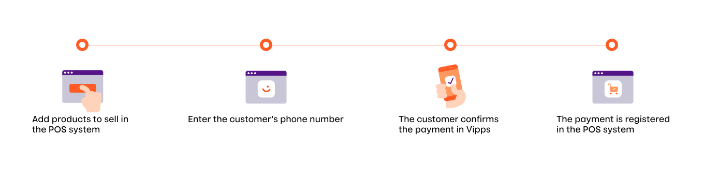
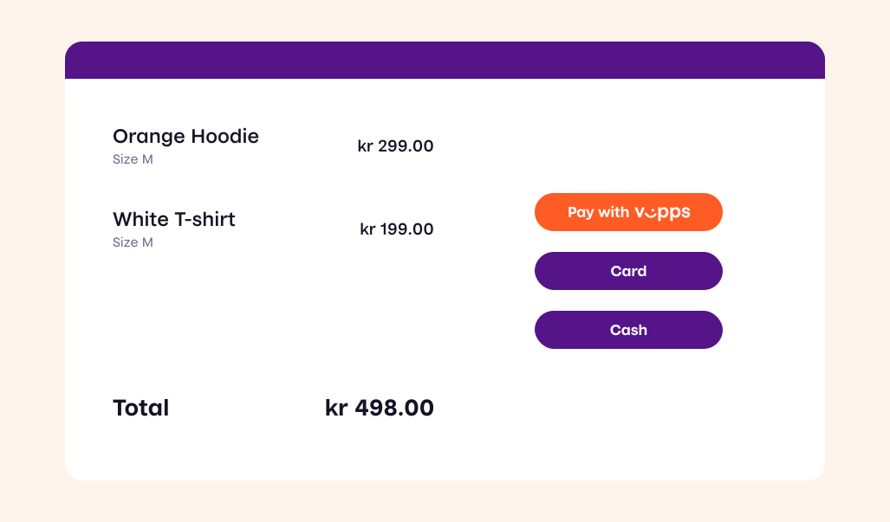
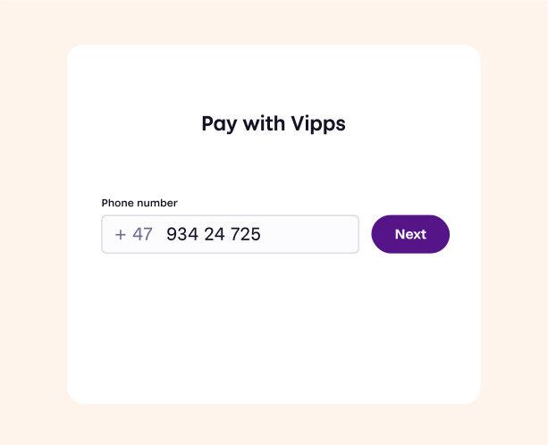
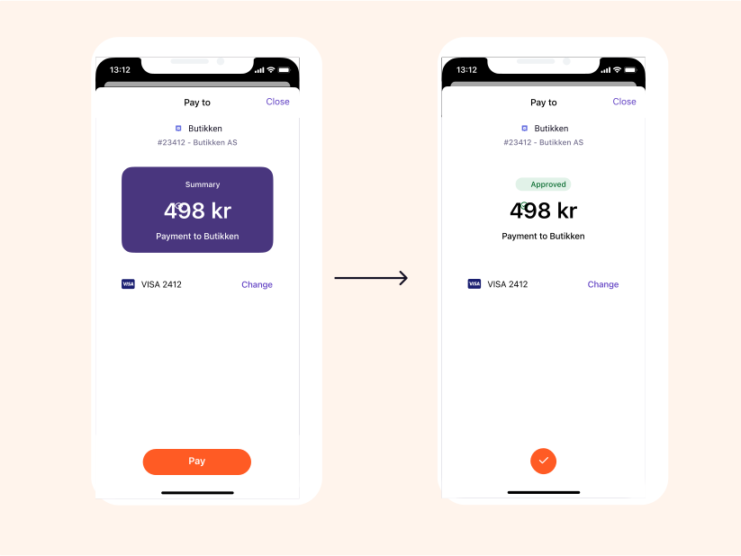
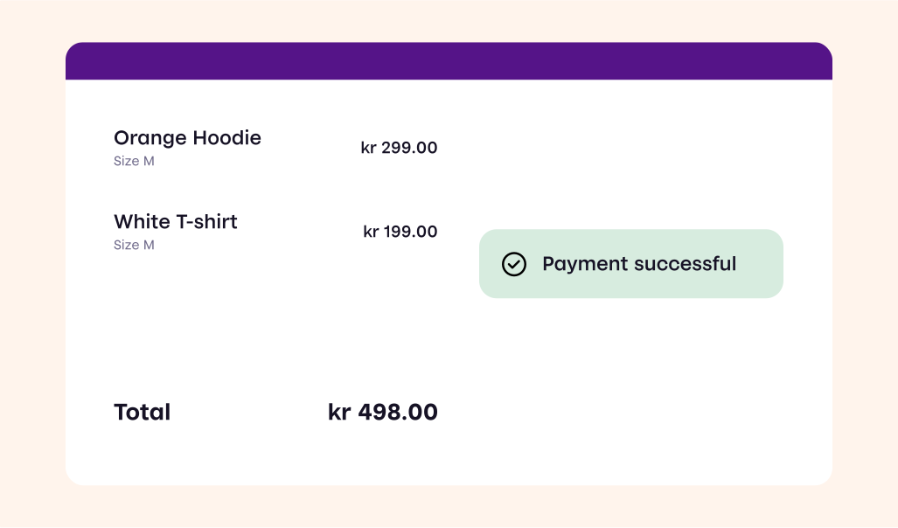

# Vipps In Store: How It Works

This page shows an example of how you can offer contactless payment to your customers by integrating Vipps in your POS system.

For technical documentation go to
[Vipps eCom API](https://github.com/vippsas/vipps-ecom-api)

## The payment process in store

## 1. Add products to sell

Add the products that the customer wants to buy in the POS system.

## 2. Enter the customer's phone number

When the customer is ready to pay, choose “Pay with Vipps”, and enter the customer’s phone number.

## 3. The customer confirms payment in Vipps

The customer confirms the payment in Vipps on their phone.

## 4. Payment is registered

The payment is registered in the POS system.

## Great! Now you know how the Vipps in store payment process works.

Take a look at the technical documentation in the [Vipps eCommerce API Guide](https://github.com/vippsas/vipps-ecom-api/blob/master/vipps-ecom-api.md)

## Questions?

We're always happy to help with code or other questions you might have!
Please create an [issue](https://github.com/vippsas/vipps-ecom-api/issues),
a [pull request](https://github.com/vippsas/vipps-ecom-api/pulls),
or [contact us](https://github.com/vippsas/vipps-developers/blob/master/contact.md).

Sign up for our [Technical newsletter for developers](https://github.com/vippsas/vipps-developers/tree/master/newsletters).
